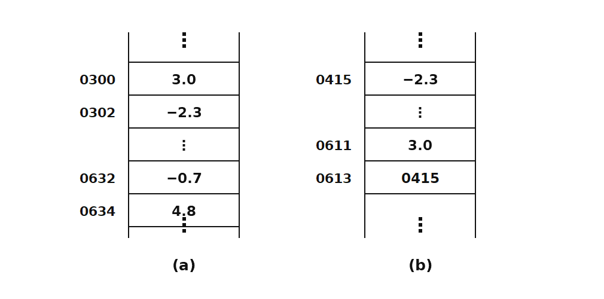
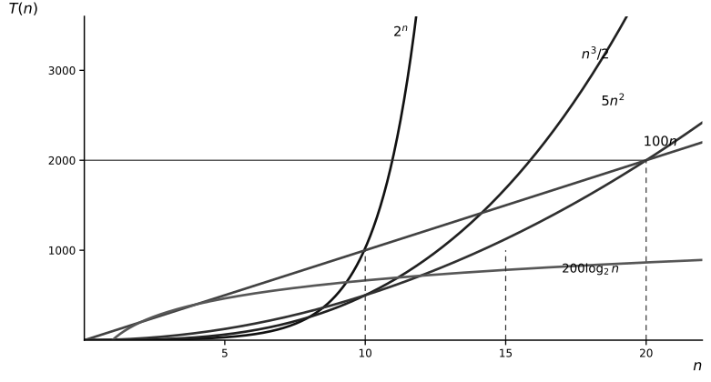

<!-- luna:source pdf_pages="11-27" book_pages="1-17" -->
# 第 1 章 绪论

> **📌 本章主线**
>
> 解决非数值问题时，先从现实对象中抽取数据元素及其关系，得到逻辑结构；再选择存储结构，把数据及关系映射到计算机中；最后用抽象数据类型规定“能做什么”，用具体表示和算法完成“怎样做”。评价算法时必须同时说明问题规模、基本操作、输入条件以及时间和辅助空间的增长量级。

> **🎯 408 复习定位**
>
> 需要能区分数据、数据元素、数据项和数据对象，区分逻辑结构与存储结构；能写出数据结构与抽象数据类型的形式表示；能按基本操作频度判断渐近复杂度，并辨认最好、平均、最坏情况及原地工作的条件。

## 本章知识地图

1. **问题抽象**：现实对象与关系形成数学模型，典型关系对应线性、树形和图状结构。
2. **结构表示**：逻辑结构回答“元素之间是什么关系”，存储结构回答“元素及关系怎样落到存储器”。
3. **接口抽象**：数据类型由值集和操作集组成；ADT 只暴露逻辑特性与操作契约，隐藏表示和实现。
4. **算法评价**：先确认合法输入与正确性，再以基本操作频度分析时间，以额外工作空间分析空间。

<!-- source: section="1.1" source_file="1-1-what-is-data-structure/index.md"
     pdf_pages="11-14" book_pages="1-4" items="例1-1, 例1-2, 例1-3, 图1.1-图1.4" -->
## 1.1 从问题到数据结构

用计算机求解问题通常经历“建立模型 → 设计算法 → 编写、测试和调整程序”。建立模型的关键不是套方程，而是识别操作对象、对象之间的关系以及需要施加的操作。非数值问题的模型常直接表现为表、树或图。

| 教材情境 | 数据元素 | 关键关系 | 对应结构与操作 |
| --- | --- | --- | --- |
| 书目检索（例 1-1） | 每本书的书目信息 | 按登录号、书名、作者、分类号组织 | 线性结构；按给定关键字查询 |
| 井字棋对弈（例 1-2） | 一个棋盘格局 | 一个格局可派生多个后继格局 | 树形结构；从根沿分支搜索结局 |
| 五叉路口管理（例 1-3） | 一条可行通路 | 两条通路能否同时通行 | 图状结构；冲突通路连边，相邻顶点异色且颜色种类尽量少 |

三个例子共同说明：**数据结构研究数据元素、元素之间的特定关系，以及定义在这些元素和关系上的操作。** 程序设计不能只选算法；结构的选择会决定算法能否自然表达及其实现代价。

> **🧭 条件与边界**
>
> “数据结构主要用于非数值计算”是本章用于引入课程的叙述，不表示数值问题中不存在数据结构。判断模型属于哪类结构，应看元素之间的逻辑关系，不能按应用领域或数据内容判断。

<!-- source: section="1.2" source_file="1-2-basic-concepts-and-terminology/index.md"
     pdf_pages="14-19" book_pages="4-9" items="式(1-1)-式(1-4), 例1-4-例1-6, 图1.5-图1.6" -->
## 1.2 基本概念与结构层次

### 数据、数据元素、数据项与数据对象

| 术语 | 定义 | 边界 |
| --- | --- | --- |
| 数据（data） | 能输入计算机并被程序处理的符号的总称 | 数值、字符、图像和声音经编码后都属于数据 |
| 数据元素（data element） | 数据的基本单位，程序通常把它作为整体处理 | 一本书的完整书目信息可以是一个数据元素 |
| 数据项（data item） | 构成数据元素的不可分割的最小单位 | 书名、作者名分别是书目元素中的数据项 |
| 数据对象（data object） | 性质相同的数据元素的集合，是数据的一个子集 | 整数集合、字母字符集合都是数据对象 |

> **⚠ 易错提醒**
>
> “基本单位”依问题抽象而定，“最小单位”则指当前讨论中不可再分的数据项。不要把数据元素与数据项互换。

### 数据结构的形式定义

**数据结构**是相互之间存在一种或多种特定关系的数据元素的集合，可形式化为二元组

$$
\mathrm{Data\_Structure}=(D,S) \tag{1-1}
$$

其中，$D$ 是数据元素的有限集，$S$ 是定义在 $D$ 上的关系的有限集。关系 $S$ 描述的是元素之间的**逻辑结构**。

| 基本逻辑结构 | 元素之间的关系特征 |
| --- | --- |
| 集合 | 除同属一个集合外，没有其他关系 |
| 线性结构 | 一个对一个 |
| 树形结构 | 一个对多个 |
| 图状结构（网状结构） | 多个对多个 |

例 1-4 把复数形式化为

$$
\mathrm{Complex}=(C,R) \tag{1-2}
$$

其中 $C=\{c_1,c_2\}$，$R=\{P\}$，$P=\{\langle c_1,c_2\rangle\}$；有序偶约定 $c_1$ 为实部、$c_2$ 为虚部。它说明集合只给出对象，关系才赋予各成分的结构语义。

例 1-5 把一个课题小组形式化为

$$
\mathrm{Group}=(P,R) \tag{1-3}
$$

$$
\begin{aligned}
P&=\{T,G_1,\ldots,G_n,S_{11}\ldots S_{nm}\},&&1\le n\le3,\ 1\le m\le2;\\
R&=\{R_1,R_2\};\\
R_1&=\{\langle T,G_i\rangle\mid1\le i\le n,\ 1\le n\le3\};\\
R_2&=\{\langle G_i,S_{ij}\rangle\mid1\le i\le n,\ 1\le j\le m,\ 1\le n\le3,\ 1\le m\le2\}.
\end{aligned}
$$

其中 $T$ 表示教师，$G_i$ 表示研究生，$S_{ij}$ 表示本科生；$R_1$ 和 $R_2$ 分别编码两层指导关系。该例展示了“元素集合 + 关系集合”如何表达树形层次。

### 逻辑结构与存储结构

**存储结构**又称物理结构，是数据结构在计算机中的表示，包括两部分：数据元素的表示，以及元素间关系的表示。数据元素在存储器中的映像常称为元素或结点；若一个元素由多个数据项组成，各数据项对应的存储片段称为数据域。

| 表示关系的方法 | 存储结构 | 关系如何编码 | 典型高级语言载体 |
| --- | --- | --- | --- |
| 顺序映像 | 顺序存储结构 | 借助存储单元的相对位置 | 一维数组 |
| 非顺序映像 | 链式存储结构 | 借助保存存储地址的指针 | C 指针与结点类型 |



*图 1.6　复数的顺序存储与链式存储（复用教材重绘图）。图中的绝对地址只用于解释两种映像方式，教材也说明实际不会用链式结构保存如此简单的复数。*

逻辑结构与存储结构不是同义词：算法的设计依赖选定的逻辑结构，算法的具体实现依赖采用的存储结构。同一种逻辑结构可以有不同存储实现；本书在高级语言层次借助数组、指针和类型定义描述“虚拟存储结构”，而不是直接操作物理地址。

### 数据类型与抽象数据类型

**数据类型**是一个值的集合以及定义在该值集上的一组操作。类型既限制变量、常量或表达式的可能取值，也限制允许执行的操作。

- **原子类型**的值不可再分，如教材语境中的整型、实型、字符型、枚举型、指针型和空类型。
- **结构类型**的值由若干成分按某种结构组成，成分本身还可以是结构类型。

**抽象数据类型（ADT）**是一个数学模型以及定义在该模型上的一组操作。它的定义只取决于逻辑特性，不取决于内部怎样表示和实现；只要数学特性和外部操作契约不变，内部表示可以替换。一个 ADT 模块通常包含定义、表示和实现三部分，其中模块外只使用抽象数据和抽象操作，表示及操作细节封装在模块内。

与数据结构的二元组对应，ADT 可写成

$$
(D,S,P) \tag{1-4}
$$

其中，$D$ 是数据对象，$S$ 是 $D$ 上的关系集，$P$ 是对 $D$ 的基本操作集。

| ADT 分类 | 值的组成特征 | 教材示例 |
| --- | --- | --- |
| 原子类型 | 值不可分解 | 100 位整数 |
| 固定聚合类型 | 成分数确定 | 由两个实数组成的复数、三元组 |
| 可变聚合类型 | 成分数不确定 | 长度可变的有序整数序列 |

教材所说的**多形数据类型**，指值的成分类型可以变化而数学关系和基本操作保持相同。例如 Triplet 的三个元素可以来自整数、字符或字符串集合，但必须支持其操作所需的关系运算。本书用 `ElemType` 作为由使用者确定的元素类型。

### ADT 操作契约

一个基本操作应给出操作名、参数、初始条件与操作结果：

- **赋值参数**只向操作提供输入；
- **引用参数**以 `&` 标记，既可提供输入，也可带回结果；
- **初始条件**是操作执行前数据结构与参数必须满足的前置条件；
- **操作结果**是正常完成后的结构变化与返回结果，即后置条件。

例 1-6 的 `Triplet` 包含构造、销毁、按位序读写、升降序判断和求最值等操作。`Get(T,i,&e)` 与 `Put(&T,i,e)` 的前置条件都是 $T$ 已存在且 $1\le i\le3$；前者不改变 $T$，后者把第 $i$ 个元素更新为 $e$。

> **⚠ 易错提醒**
>
> ADT 规定“对象、关系、操作及其契约”，存储结构规定“怎样表示”。把 `Triplet` 定义为指针数组属于实现选择，不属于 ADT 的逻辑定义。

<!-- source: section="1.3" source_file="1-3-abstract-data-type-representation-and-implementation/index.md"
     pdf_pages="19-23" book_pages="9-13" items="类C约定(1)-(11), 例1-7" -->
## 1.3 ADT 的类 C 表示与实现

本书使用介于伪码与 C/C++ 之间的类 C 语言：它便于表达算法，但并非可以直接交给标准 C 编译器的完整程序。阅读后续代码前应先统一以下约定。

### 状态、类型与参数约定

```cpp
#define TRUE        1
#define FALSE       0
#define OK          1
#define ERROR       0
#define INFEASIBLE -1
#define OVERFLOW   -2
typedef int Status;
```

- `ElemType` 由使用者定义；存储结构通常用 `typedef` 描述。
- 返回执行状态的操作用 `Status` 类型；`OK` 与 `TRUE` 都是 `1`，`ERROR` 与 `FALSE` 都是 `0`，必须结合接口语义解释，不能只看数值。
- 形参前的 `&` 采用 C++ 引用调用语义，不是标准 C 语法。
- 辅助变量常省略声明；`a,b,...` 常表示元素，`i,j,...` 常表示整数，`p,q,...` 常表示指针。这些只是教材记号约定。

### 扩展语句与求值规则

| 类 C 写法 | 含义或注意点 |
| --- | --- |
| `(x,y)=(a,b)`、结构整体赋值、区间赋值 | 成组或批量赋值，是算法描述记号 |
| `x↔y` | 交换赋值，不是标准 C 运算符 |
| `switch { case 条件: ... }` | 按条件选择的伪码扩展，不是标准 C `switch` |
| `max`、`min`、`abs`、`floor`、`ceil`、`eof`、`eoln` | 教材预定义的基本函数或判定 |
| `A && B` | 若 `A==0`，不再求值 `B` |
| `A \|\| B` | 若 `A!=0`，不再求值 `B` |

循环、选择、`return`、`break`、`exit`、输入输出和 `//` 注释基本沿用 C 风格；教材的输入输出常省略格式串。短路求值不仅影响效率，也常用于先检查指针或下标合法性，再访问对象。

### 例 1-7：Triplet 实现中的边界

```cpp
typedef ElemType *Triplet;

Status InitTriplet(Triplet &T, ElemType v1, ElemType v2, ElemType v3) {
    T = (ElemType *)malloc(3 * sizeof(ElemType));
    if (!T) exit(OVERFLOW);
    T[0] = v1; T[1] = v2; T[2] = v3;
    return OK;
}

Status DestroyTriplet(Triplet &T) {
    free(T);
    T = NULL;
    return OK;
}

Status Get(Triplet T, int i, ElemType &e) {
    if (i < 1 || i > 3) return ERROR;
    e = T[i - 1];
    return OK;
}

Status Put(Triplet &T, int i, ElemType e) {
    if (i < 1 || i > 3) return ERROR;
    T[i - 1] = e;
    return OK;
}
```

正确性要点有三条：初始化必须先成功分配三个元素的空间；销毁后把 `T` 置为 `NULL`，避免继续把它当作有效三元组；ADT 位序为 $1,2,3$，数组下标为 $0,1,2$，因此访问位置是 `T[i-1]`。升序与降序判断分别检查相邻元素的 `<=` 与 `>=`，求最大值和最小值则在三个元素间比较并通过引用参数返回结果。

> **🧭 条件与边界**
>
> 教材接口把“T 已存在”写作前置条件，因此 `Get`、`Put` 等实现只检查位序，没有再次检查空指针。若把接口用于不受控调用环境，可把对象有效性纳入防御性检查；这属于强化实现，不能反过来改写原 ADT 契约。

<!-- source: section="1.4" source_file="1-4-algorithms-and-analysis/index.md"
     pdf_pages="23-27" book_pages="13-17" items="式(1-5), 式(1-6), 图1.7, 矩阵乘法, 起泡排序" -->
## 1.4 算法与算法分析

### 算法的定义与五个特性

**算法**是对特定问题求解步骤的描述，是由操作指令构成的有限序列。在本书的定义范围内，算法具有五个特性：

1. **有穷性**：对任何合法输入，执行有穷步后结束，每一步也能在可接受的有穷时间内完成。
2. **确定性**：每条指令含义确切、无二义；相同输入沿确定路径得到相同输出。
3. **可行性**：每个操作都能由已经实现的基本运算执行有限次完成。
4. **输入**：有零个或多个输入，输入来自规定的对象集合。
5. **输出**：有一个或多个输出，且输出与输入具有问题规定的关系。

> **⚠ 易错提醒**
>
> 算法可以没有输入，但不能没有输出；有穷性要求对所有合法输入都终止，不能只验证几个样例。这里的“确定性”是教材采用的经典算法定义，答题时应按题目给定的算法模型判断。

### 好算法的基本要求

| 要求 | 判断标准 |
| --- | --- |
| 正确性 | 对一切合法输入都满足规格说明；仅无语法错或通过若干样例都不足以构成严格证明 |
| 可读性 | 结构和含义便于人理解、交流、调试与修改 |
| 健壮性 | 非法输入能得到适当响应；教材倡导返回错误信息供更高层处理，而不是输出异常结果 |
| 效率与低存储量 | 时间和最大存储需求应结合问题规模比较 |

教材把程序正确性区分为四层：无语法错误；对若干输入正确；对精心选择的典型和苛刻输入正确；对一切合法输入正确。前三层测试强度逐步增加，但严格意义的算法正确性对应最后一层，通常还需要证明而非穷举测试。

### 时间复杂度：从基本操作频度到渐近阶

**事后统计**直接运行程序并计时，能反映实际环境，却依赖硬件、语言、编译器、实现质量和测试数据。**事前分析**撇开这些环境因素，在选定问题规模 $n$ 与基本操作后，统计基本操作的执行次数。

若基本操作的频度为 $f(n)$，算法的渐近时间复杂度记为

$$
T(n)=O(f(n)) \tag{1-5}
$$

形式上，$x_n=O(f(n))$ 表示存在正常数 $M$ 和 $n_0$，使所有 $n\ge n_0$ 都满足 $|x_n|\le M|f(n)|$。因此大 $O$ 给出渐近上界；分析具体程序时，通常保留频度中增长最快的项并忽略常数因子。

#### 频度计算的最小例

- 顺序语句中的基本操作执行 $1$ 次，复杂度为 $O(1)$。
- 单层循环执行 $n$ 次，复杂度为 $O(n)$。
- 两层各执行 $n$ 次的嵌套循环执行 $n^2$ 次，复杂度为 $O(n^2)$。
- 教材三重循环的 $n\times n$ 矩阵乘法，以乘法为基本操作，共执行 $n^3$ 次，故为 $O(n^3)$。
- 对 `i=2..n`、`j=2..i-1` 的嵌套循环，内层基本操作总次数为

$$
\sum_{i=2}^{n}(i-2)=\frac{(n-1)(n-2)}{2}=O(n^2).
$$



*图 1.7　常见函数的增长率（复用教材重绘图）。曲线在有限区间可能交叉，渐近比较关注 $n$ 充分大后的增长趋势。*

常见量级从低到高通常为

$$
O(1)<O(\log n)<O(n)<O(n\log n)<O(n^2)<O(n^3)<O(2^n).
$$

比较量级时必须说明是同一问题、同一规模定义下的算法。若保持硬件、实现与数据条件近似不变，并且主导项确为 $n^3$，才可以按立方比例粗略外推矩阵乘法的运行时间；单凭大 $O$ 记号不能推出精确耗时。

### 最好、平均与最坏情况

当频度还依赖输入数据的排列或取值时，必须说明分析的是哪一种情况。教材的起泡排序使用 `change` 提前终止：

```text
for (i = n - 1, change = TRUE; i >= 1 && change; --i) {
    change = FALSE;
    for (j = 0; j < i; ++j)
        if (a[j] > a[j + 1]) {
            a[j] ↔ a[j + 1];
            change = TRUE;
        }
}
```

循环不变量是：每完成一趟，当前未定区间的最大元素被交换到该区间末尾；若一趟没有交换，则整个序列已经有序，可以终止。若把“交换相邻整数”作为基本操作：

| 输入条件 | 交换次数 | 结论 |
| --- | --- | --- |
| 初始序列已升序 | $0$ | 最好情况下无交换；不等于整个程序没有比较和循环开销 |
| 初始序列逆序 | $n(n-1)/2$ | 最坏情况为 $O(n^2)$ |
| $n!$ 种排列等概率 | 期望为二次量级 | 平均时间复杂度为 $O(n^2)$；若输入分布未知，该平均结论缺少依据 |

教材后续若未特别说明，时间复杂度默认指**最坏情况**。最坏复杂度提供执行代价的渐近上界；平均复杂度必须有输入分布或概率模型，不能把“看起来通常如此”当作等概率假设。

### 空间复杂度与原地工作

算法所需存储空间的增长量级记为

$$
S(n)=O(f(n)) \tag{1-6}
$$

程序运行空间包括程序指令、常数、变量、输入数据和辅助工作单元。若输入数据空间只由问题本身决定、与算法无关，比较算法时通常分析程序和输入之外的**额外空间**；若输入表示也由算法选择，则应一并计入。

额外空间相对输入规模为常量，即 $O(1)$ 时，教材称算法为**原地工作**。若空间需求依赖具体输入而题目未另作说明，也按最坏情况分析。

> **⚠ 易错提醒**
>
> 原地算法不是“完全不占空间”，而是额外空间不随输入规模增长；递归调用栈、临时数组和动态结点都可能使辅助空间超过 $O(1)$。

## 章末对照

| 层次 | 核心问题 | 典型表达 |
| --- | --- | --- |
| 逻辑结构 | 元素之间是什么关系 | $(D,S)$；集合、线性、树、图 |
| 存储结构 | 元素及关系怎样映射到计算机 | 顺序映像、链式映像 |
| ADT | 对象允许哪些操作，前后条件是什么 | $(D,S,P)$；值参数与引用参数 |
| 算法 | 怎样在有限步骤内完成操作 | 输入、输出、确定、可行、终止 |
| 复杂度 | 代价怎样随规模增长 | $T(n)$、$S(n)$、最好/平均/最坏条件 |

## 复习闭环

- 能否用同一个例子说明数据元素、数据项、数据对象和数据结构的区别？
- 能否说明“逻辑结构相同而存储结构不同”为什么会改变算法实现？
- 能否从 ADT 操作的初始条件与操作结果写出边界检查和返回语义？
- 能否先选基本操作，再计算频度并写明最好、平均或最坏条件？
- 能否区分输入空间、辅助空间和原地工作的含义？
