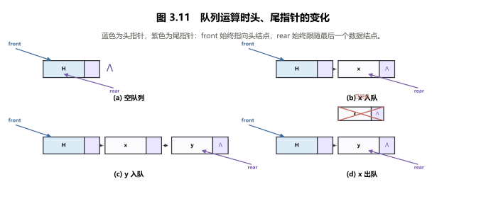
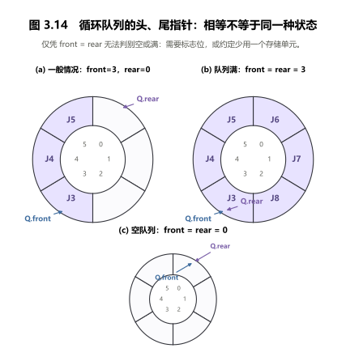
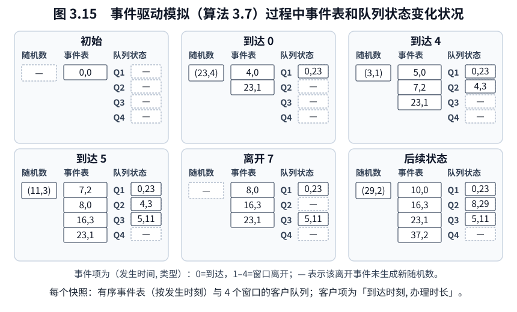

<!-- luna:source pdf_pages="54-79" book_pages="44-69" -->
# 第 3 章 栈和队列

> **📌 本章主线**
>
> 栈和队列都是操作受限的线性表：栈只在表尾插入和删除，形成后进先出；队列在一端插入、另一端删除，形成先进先出。复习时应把逻辑约束、存储表示、指针或下标不变量、边界判定和典型应用连成一条知识链。

> **🎯 408 复习定位**
>
> 需要会判断合法出入序列，写出顺序栈、链队列和循环队列的关键操作，手推括号匹配、表达式求值、递归工作栈与事件驱动过程，并能说明每个复杂度结论依赖的表示和边界条件。

## 本章知识地图

- **栈**：表尾是唯一修改端，核心不变量是“最后进入者最先离开”。
- **栈的应用**：当产生顺序与使用顺序相反，或需要保存可回退状态时使用栈。
- **递归实现**：每次调用的参数、局部变量和返回地址形成工作记录，按调用顺序压栈、按相反顺序退栈。
- **队列**：队尾入、队头出；链队列依赖首尾指针一致性，循环队列依赖模运算和明确的空满约定。
- **离散事件模拟**：有序事件表决定下一时刻，多个 FIFO 队列保存各窗口客户；每次只处理当前最早事件。

<!-- source: section="3.1" source_file="3-1-stack/index.md" pdf_pages="54-57" book_pages="44-47" items="图3.1-图3.3" -->
## 3.1 栈：LIFO 与受限线性表

### 定义、边界与 ADT

**栈**（stack）是只允许在线性表表尾进行插入和删除的线性表。表尾称为**栈顶**（top），表头称为**栈底**（bottom）；不含元素的栈称为空栈。

若 $S=(a_1,a_2,\ldots,a_n)$，则 $a_1$ 是栈底元素，$a_n$ 是栈顶元素。元素按 $a_1,a_2,\ldots,a_n$ 入栈时，只能按 $a_n,a_{n-1},\ldots,a_1$ 出栈，因此栈是**后进先出**（last in first out，LIFO）结构。

栈的基本操作及前置条件如下。

| 操作 | 前置条件 | 结果 |
| --- | --- | --- |
| `InitStack(&S)` | 无 | 构造空栈 |
| `DestroyStack(&S)` | 栈已存在 | 销毁栈 |
| `ClearStack(&S)` | 栈已存在 | 清为空栈 |
| `StackEmpty(S)` | 栈已存在 | 判断是否为空 |
| `StackLength(S)` | 栈已存在 | 返回元素个数 |
| `GetTop(S, &e)` | 栈已存在且非空 | 读取栈顶而不删除 |
| `Push(&S, e)` | 栈已存在 | 插入新栈顶 |
| `Pop(&S, &e)` | 栈已存在且非空 | 删除并返回栈顶 |
| `StackTraverse(S, visit)` | 栈已存在且非空 | 自栈底向栈顶访问，访问失败则操作失败 |

`GetTop` 不改变栈，`Pop` 改变栈；二者都必须先判空。元素类型由应用定义，栈 ADT 的顺序约束不依赖具体元素类型。

### 顺序栈：表示、不变量与核心操作

顺序栈用连续存储区保存自栈底到栈顶的元素。教材采用以下指针约定：`base` 指向栈底存储位置，`top` 指向**栈顶元素的下一位置**，`stacksize` 表示当前已分配容量。

```cpp
typedef struct {
    SElemType *base;
    SElemType *top;
    int stacksize;
} SqStack;
```

> **📌 必背结论**
>
> 栈存在时，空栈满足 `top == base`；非空栈的栈顶元素是 `*(top - 1)`；栈长为 `top - base`。`base == NULL` 表示栈尚未构造或已经销毁，不等同于“已存在的空栈”。

教材接口采用带引用参数的 C++ 式记法。以下保留初始化、取顶、入栈和出栈的关键分支。

```cpp
Status InitStack(SqStack &S) {
    S.base = (SElemType *)malloc(STACK_INIT_SIZE * sizeof(SElemType));
    if (!S.base) exit(OVERFLOW);
    S.top = S.base;
    S.stacksize = STACK_INIT_SIZE;
    return OK;
}

Status GetTop(SqStack S, SElemType &e) {
    if (S.top == S.base) return ERROR;
    e = *(S.top - 1);
    return OK;
}

Status Push(SqStack &S, SElemType e) {
    if (S.top - S.base >= S.stacksize) {
        S.base = (SElemType *)realloc(
            S.base,
            (S.stacksize + STACKINCREMENT) * sizeof(SElemType)
        );
        if (!S.base) exit(OVERFLOW);
        S.top = S.base + S.stacksize;
        S.stacksize += STACKINCREMENT;
    }
    *S.top++ = e;
    return OK;
}

Status Pop(SqStack &S, SElemType &e) {
    if (S.top == S.base) return ERROR;
    e = *--S.top;
    return OK;
}
```

扩容后必须用新 `base` 重建 `top`。扩容前旧栈长等于旧 `stacksize`，所以新地址中的栈顶下一位置是 `S.base + S.stacksize`；若继续沿用旧 `top`，`realloc` 搬迁存储区后该指针可能失效。

入栈语句 `*S.top++ = e` 先写入 `top` 所指空位，再令 `top` 后移；出栈语句 `e = *--S.top` 先令 `top` 前移到原栈顶元素，再读取该元素。两处自增、自减顺序不能互换。

### 链栈

图 3.3 所示链栈用单链表保存元素，栈指针 `S` 指向栈顶结点，后继链依次通向栈底。为使入栈和出栈都只修改栈顶附近的链接，栈顶放在链表头端；源文没有单列该链式模块的空栈表示约定。

链栈不要求预先估计容量，空间按结点分配；代价是每个元素还需保存链接域。教材只给出图 3.3 并说明其操作是单链表操作的特例，未给出独立模块代码。

### 栈操作的复杂度与边界

| 操作或情形 | 顺序栈 | 链栈 | 成立条件 |
| --- | --- | --- | --- |
| 判空、取顶、出栈 | $O(1)$ | $O(1)$ | 已持有栈对象，非空操作先判空 |
| 普通入栈 | $O(1)$ | $O(1)$ | 顺序栈尚有容量；链栈分配成功 |
| 顺序栈扩容的一次入栈 | 最坏 $O(n)$ | 不适用 | `realloc` 可能搬移已有 $n$ 个元素 |
| 辅助存储 | 连续容量 | 每结点含链接域 | 不含元素本身占用 |

教材按固定增量扩容；单次不扩容的入栈仍是 $O(1)$，但不能把发生搬迁的扩容步骤也直接称为 $O(1)$。

<!-- source: section="3.2" source_file="3-2-stack-applications/index.md" pdf_pages="58-64" book_pages="48-54" items="算法3.1-算法3.4, 表3.1-表3.2, 图3.4, 例3-1" -->
## 3.2 栈的典型应用

栈适合两类过程：一类是“先产生的内容后使用”，另一类是“向前探索时保存现场，失败时按相反顺序回退”。

### 数制转换：逆序输出余数

对非负十进制整数 $N$ 和进制基数 $d$，每一步满足

$$
N=(N\ \operatorname{div}\ d)\times d+N\ \operatorname{mod}\ d.
$$

连续求余得到的数位顺序是从低位到高位，而输出要求从高位到低位。把余数依次入栈，再依次出栈，即可反转顺序。教材算法 3.1 以八进制为例：

| 当前 $N$ | $N\ \operatorname{div}\ 8$ | $N\ \operatorname{mod}\ 8$ |
| ---: | ---: | ---: |
| 1348 | 168 | 4 |
| 168 | 21 | 0 |
| 21 | 2 | 5 |
| 2 | 0 | 2 |

余数入栈序列为 $4,0,5,2$，出栈得到 $(2504)_8$。

```text
若 N = 0，输出 0 并结束；
while N > 0:
    Push(S, N mod 8)
    N = N div 8
while S 非空:
    Pop(S, e)
    输出 e
```

> **⚠ 算法 3.1 的零值边界**
>
> 原书算法 3.1 的说明把输入域写成“任意非负十进制整数”，但代码中的 `while (N)` 在 $N=0$ 时不会压入或输出任何数位。因此，原代码只直接覆盖 $N>0$；要覆盖其声明的完整输入域，必须加入上面的 `N=0` 输出 `0` 分支。这是对原算法边界的显式补全，不改变 $N>0$ 时的求余入栈过程。

若输入共有 $k$ 个 $d$ 进制数位，则时间为 $O(k)$，辅助栈空间为 $O(k)$。

### 括号匹配：未消解期待栈

扫描由圆括号和方括号组成的序列时，栈始终保存**已经出现但尚未匹配的左括号**，栈顶是当前最急需匹配的左括号。

```text
for 每个字符 ch:
    若 ch 是左括号：入栈
    若 ch 是右括号：
        若栈空：不匹配
        弹出栈顶 left
        若 left 与 ch 类型不同：不匹配
扫描结束后，仅当栈空时匹配成功
```

循环不变量是：处理完任意前缀后，栈从底到顶正好是该前缀中按出现顺序排列的未匹配左括号。右括号遇到空栈表示缺少左括号；扫描结束栈非空表示缺少右括号；栈顶类型不同表示嵌套次序错误。

对长度为 $n$ 的序列，时间为 $O(n)$，最坏辅助空间为 $O(n)$。

### 行编辑：撤销最近输入

教材算法 3.2 以字符栈作为一行的输入缓冲区：普通字符入栈，退格符 `#` 删除最近输入的字符，退行符 `@` 清除当前整行。换行或文件结束时，再从栈底到栈顶传送有效字符。

| 输入片段 | 栈操作 | 有效结果 |
| --- | --- | --- |
| `whli##ilr#e(s# * s)` | `#` 两次撤销 `i,l`，随后再撤销 `r`、`s` | `while (*s)` |
| `outcha@putchar(*s =# ++);` | `@` 清空前缀，`#` 撤销 `=` | `putchar(*s++);` |

退格时只能在栈非空时执行 `Pop`；`@` 只清空当前行，不销毁栈对象。对一行的 $n$ 个输入字符，处理时间为 $O(n)$，辅助空间不超过该行尚未撤销的字符数。

### 迷宫求解：显式回溯栈

算法 3.3 在方块迷宫中寻找从入口到出口的一条简单路径。栈元素保存路径序号 `ord`、方块坐标 `seat` 和下一探索方向 `di`；方向按东、南、西、北编号并依次尝试。

“当前位置可通”不仅要求它是通道，还要求它既不在当前路径中，也未被先前失败路径访问。这个条件保证所得路径不含重复方块，并阻止在死胡同中循环。

```text
curpos = 入口，curstep = 1
do:
    若 curpos 可通：
        留下足迹，将 (curstep, curpos, 1) 入栈
        若 curpos 是出口：成功
        curpos = 当前块的东邻；curstep++
    否则若栈非空：
        弹出栈顶 e
        while e.di == 4 且栈非空：
            将 e.seat 标记为不可再走
            继续弹出上一通道块
        若 e.di < 4：
            e.di++，把 e 重新入栈
            curpos = e.seat 在新方向上的相邻块
while 栈非空
失败
```

栈的不变量是：自栈底到栈顶恰好构成从入口到当前候选位置之前的简单路径；每个记录的 `di` 表示从该方块已经尝试到的方向。回退时必须保留并递增 `di`，否则会重复探索同一分支。

若迷宫有 $r\times c$ 个方块、每个方块只在常数个方向上检查且访问标记可在 $O(1)$ 时间读写，则时间和最坏辅助栈空间均为 $O(rc)$。

### 表达式求值：双栈算符优先法

简单算术表达式由操作数、运算符和界限符组成。教材把运算符与界限符统称为算符，集合记为 $OP$；这里只处理 `+`、`-`、`*`、`/`、圆括号和结束符 `#`。

相继出现的栈顶算符 $\theta_1$ 与当前输入算符 $\theta_2$ 只有三种有效关系：

$$
\begin{aligned}
\theta_1<\theta_2 &\quad \text{栈顶优先权低，输入算符入栈},\\
\theta_1=\theta_2 &\quad \text{界限符配对，弹出栈顶并读下一项},\\
\theta_1>\theta_2 &\quad \text{栈顶优先权高，立即完成一次运算}.
\end{aligned}
$$

表 3.1 的完整优先关系如下；空白处表示这两个算符不应相继出现，遇到时应判为语法错误。

| $\theta_1\backslash\theta_2$ | `+` | `-` | `*` | `/` | `(` | `)` | `#` |
| :---: | :---: | :---: | :---: | :---: | :---: | :---: | :---: |
| `+` | `>` | `>` | `<` | `<` | `<` | `>` | `>` |
| `-` | `>` | `>` | `<` | `<` | `<` | `>` | `>` |
| `*` | `>` | `>` | `>` | `>` | `<` | `>` | `>` |
| `/` | `>` | `>` | `>` | `>` | `<` | `>` | `>` |
| `(` | `<` | `<` | `<` | `<` | `<` | `=` | — |
| `)` | `>` | `>` | `>` | `>` | — | `>` | `>` |
| `#` | `<` | `<` | `<` | `<` | `<` | — | `=` |

算法 3.4 使用两个工作栈：`OPTR` 保存算符，`OPND` 保存操作数或中间结果。表达式两端各设一个 `#`；当 `OPTR` 栈顶和当前输入都为 `#` 时结束。

```text
Push(OPTR, '#')
读取 c
while c != '#' 或 GetTop(OPTR) != '#':
    若 c 不是算符：
        Push(OPND, c)，读取下一项
    否则按 Precede(GetTop(OPTR), c)：
        '<'：Push(OPTR, c)，读取下一项
        '='：Pop(OPTR)，读取下一项
        '>'：
            Pop(OPTR, theta)
            Pop(OPND, b)，Pop(OPND, a)
            Push(OPND, Operate(a, theta, b))
返回 OPND 栈顶
```

弹出两个操作数时先得到右操作数 $b$，再得到左操作数 $a$，运算次序必须是 $a\ \theta\ b$。处理任意前缀后，`OPND` 保存已识别但尚未全部合并的值，`OPTR` 保存仍待决的算符和界限符。

**例 3-1：利用算法 `EvaluateExpression` 对算术表达式 $3\times(7-2)$ 求值。** 先压入 `3`、`*`、`(`、`7`、`-`、`2`；遇到 `)` 时先算 $7-2=5$，再消去括号；遇到结尾 `#` 时算 $3\times5=15$。算法 3.4 的函数签名和表 3.2 的题注均使用 `EvaluateExpression`，因此这就是例题所指的正式算法名。

在每个栈操作和优先关系查询均为 $O(1)$ 的条件下，长度为 $n$ 的表达式求值时间为 $O(n)$，两个栈合计最坏占用 $O(n)$。教材在此假定输入没有语法错误；空白关系需要在完整实现中转为错误分支。

<!-- source: section="3.3" source_file="3-3-stack-and-recursion/index.md" pdf_pages="64-68" book_pages="54-58" items="式(3-1)-式(3-4), 例3-2, 算法3.5, 图3.5-图3.7" -->
## 3.3 栈与递归实现

### 递归的定义与三类来源

函数直接调用自身，或经过一系列调用间接回到自身，均称为递归函数。教材给出三类适合递归描述的来源：数学对象本身按递归定义；数据结构本身具有递归层次；问题可分解为规模更小、形式相同的子问题。

阶乘函数为

$$
\operatorname{Fact}(n)=
\begin{cases}
1, & n=0,\\
n\cdot\operatorname{Fact}(n-1), & n>0.
\end{cases}
\tag{3-1}
$$

二阶 Fibonacci 数列为

$$
\operatorname{Fib}(n)=
\begin{cases}
0, & n=0,\\
1, & n=1,\\
\operatorname{Fib}(n-1)+\operatorname{Fib}(n-2), & \text{其他情形}.
\end{cases}
\tag{3-2}
$$

Ackerman 函数为

$$
\operatorname{Ack}(m,n)=
\begin{cases}
n+1, & m=0,\\
\operatorname{Ack}(m-1,1), & n=0,\\
\operatorname{Ack}(m-1,\operatorname{Ack}(m,n-1)), & \text{其他情形}.
\end{cases}
\tag{3-3}
$$

二叉树、广义表等结构的操作可随其递归结构描述；Hanoi 塔和八皇后问题则属于问题分解能自然形成递归的情形。

### Hanoi 塔：递归分解

有 X、Y、Z 三个塔座，X 上有 $n$ 个直径不同的圆盘，小盘在大盘之上。移动必须同时满足：每次只移动一个圆盘；可在三个塔座间移动；任何时刻大盘都不能压在小盘之上。

当 $n=1$ 时，直接把圆盘从 X 移到 Z。当 $n>1$ 时：

1. 把 X 上的 $n-1$ 个小圆盘移到 Y，Z 作辅助塔；
2. 把第 $n$ 个圆盘从 X 移到 Z；
3. 把 Y 上的 $n-1$ 个圆盘移到 Z，X 作辅助塔。

每个递归子问题仍满足相同的三条移动规则，只是规模由 $n$ 降为 $n-1$。

### 算法 3.5：Hanoi 递归实现

```c
void hanoi(int n, char x, char y, char z) {
    if (n == 1) {
        move(x, 1, z);
    } else {
        hanoi(n - 1, x, z, y);
        move(x, n, z);
        hanoi(n - 1, y, x, z);
    }
}
```

前置条件是 $n\ge 1$，且初始时 $n$ 个圆盘在 `x` 上按小到大自上而下合法叠放。递归不变量是：每次 `hanoi(n,x,y,z)` 调用开始时，待移动的 $n$ 个圆盘在 `x` 上合法叠放；调用返回时，它们在 `z` 上保持同样的合法次序。

由算法 3.5 可直接得到移动次数递推式

$$
T(1)=1,\qquad T(n)=2T(n-1)+1,
$$

从而 $T(n)=2^n-1$，时间为 $O(2^n)$。递归调用的最大嵌套层数为 $n$，故只计活动记录时辅助空间为 $O(n)$。

### 运行栈、工作记录与活动记录

普通函数调用前，系统需完成三件事：传递并保存实参、返回地址等信息；为局部变量分配存储区；把控制转移到被调用函数入口。返回前则要保存计算结果、释放被调用函数数据区，并按返回地址把控制交还调用者。

嵌套调用遵循“后调用先返回”，所以各次调用的数据区按栈管理。每调用一个函数，就在栈顶分配一块数据区；函数退出时释放栈顶数据区；当前正在运行的函数数据区总在栈顶。

递归调用与嵌套调用机制相同，只是调用函数和被调用函数相同。若主函数记作第 0 层，则主函数首次调用递归函数进入第 1 层，第 $i$ 层再次调用自身进入第 $i+1$ 层，第 $i$ 层退出后返回第 $i-1$ 层。

每层递归的**工作记录**包括实在参数、局部变量和上一层返回地址。进入一层就把新记录压栈，退出一层就弹出记录；栈顶工作记录称为**活动记录**，指向它的栈顶指针称为**当前环境指针**。

对式

$$
\operatorname{hanoi}(3,a,b,c)
\tag{3-4}
$$

教材图 3.7 的记录格式为“返回地址，$n,x,y,z$”，并以栈顶记录在前。其关键状态可压缩为：

| 当前层 | 栈顶到栈底的主要记录 | 语义 |
| ---: | --- | --- |
| 1 | `0,3,a,b,c` | 主函数进入 `hanoi(3,a,b,c)` |
| 2 | `6,2,a,c,b`；`0,3,a,b,c` | 第一次递归，把两个小盘移向辅助塔 |
| 3 | `6,1,a,b,c`；`6,2,a,c,b`；`0,3,a,b,c` | 到达基例，移动 1 号盘后返回 |
| 0 | 栈空 | 七次移动完成，控制返回主函数 |

参数既可按值传递，也可传递地址；具体传递和返回约定由程序设计语言规定。实际系统通常统一处理递归与非递归调用，“递归工作栈”是用于解释其机制的抽象。

<!-- source: section="3.4" source_file="3-4-queue/index.md" pdf_pages="68-75" book_pages="58-65" items="图3.8-图3.14" -->
## 3.4 队列：FIFO 与双端变体

### 队列的定义、边界与 ADT

**队列**（queue）是只允许在一端插入、在另一端删除的线性表。允许插入的一端称为**队尾**（rear），允许删除的一端称为**队头**（front）。

若 $Q=(a_1,a_2,\ldots,a_n)$，则 $a_1$ 是队头元素，$a_n$ 是队尾元素；元素按 $a_1,a_2,\ldots,a_n$ 入队，也只能按同样次序出队。因此队列是**先进先出**（first in first out，FIFO）结构。

| 操作 | 前置条件 | 结果 |
| --- | --- | --- |
| `InitQueue(&Q)` | 无 | 构造空队列 |
| `DestroyQueue(&Q)` | 队列已存在 | 销毁队列 |
| `ClearQueue(&Q)` | 队列已存在 | 清为空队列 |
| `QueueEmpty(Q)` | 队列已存在 | 判断是否为空 |
| `QueueLength(Q)` | 队列已存在 | 返回元素个数 |
| `GetHead(Q, &e)` | 队列非空 | 读取队头而不删除 |
| `EnQueue(&Q, e)` | 队列已存在 | 在队尾插入 |
| `DeQueue(&Q, &e)` | 队列非空 | 删除并返回队头 |
| `QueueTraverse(Q, visit)` | 队列已存在且非空 | 自队头向队尾访问，访问失败则操作失败 |

### 双端队列

**双端队列**（deque）允许在表的两个端点插入和删除。它的受限变体包括：

- **输出受限双端队列**：一个端点可插入和删除，另一个端点只允许插入。
- **输入受限双端队列**：一个端点可插入和删除，另一个端点只允许删除。
- 若规定从某端插入的元素只能从同一端删除，则结构退化为两个栈底相邻的栈。

### 链队列：头结点与首尾指针不变量

链队列用单链表表示，并增设头结点。`front` 始终指向头结点，`rear` 指向最后一个数据结点；空队列满足 `front == rear`，且二者都指向头结点。

```cpp
typedef struct QNode {
    QElemType data;
    struct QNode *next;
} QNode, *QueuePtr;

typedef struct {
    QueuePtr front;
    QueuePtr rear;
} LinkQueue;
```

图 3.11 展示空队列、连续入队和出队时的指针变化。正文中的等价结论是：入队只接到 `rear` 之后并更新 `rear`；出队只删除头结点之后的首个数据结点；删除唯一数据结点后还必须把 `rear` 重置为 `front`。



*图 3.11　基于教材图 3.11 的确定性重绘。*

```cpp
Status InitQueue(LinkQueue &Q) {
    Q.front = Q.rear = (QueuePtr)malloc(sizeof(QNode));
    if (!Q.front) exit(OVERFLOW);
    Q.front->next = NULL;
    return OK;
}

Status EnQueue(LinkQueue &Q, QElemType e) {
    QueuePtr p = (QueuePtr)malloc(sizeof(QNode));
    if (!p) exit(OVERFLOW);
    p->data = e;
    p->next = NULL;
    Q.rear->next = p;
    Q.rear = p;
    return OK;
}

Status DeQueue(LinkQueue &Q, QElemType &e) {
    if (Q.front == Q.rear) return ERROR;
    QueuePtr p = Q.front->next;
    e = p->data;
    Q.front->next = p->next;
    if (Q.rear == p) Q.rear = Q.front;
    free(p);
    return OK;
}
```

> **⚠ 易错提醒**
>
> 删除最后一个数据结点时，只改 `front->next` 会留下指向已释放结点的 `rear`。必须先判断 `Q.rear == p`，再令 `Q.rear = Q.front`，恢复空队列不变量。

销毁链队列时需从头结点开始逐结点释放，直到 `front == NULL`；它与“清空但保留头结点”的语义不同。

### 循环队列：回绕、判空判满与长度

普通顺序队列的 `front`、`rear` 只向高地址移动，会出现数组尾部已到界而前部仍有空位的“假溢出”。循环队列把下标 $0,1,\ldots,M-1$ 逻辑连接成环，所有下标更新都对容量 $M$ 取模。

教材约定：`front` 指向队头元素，`rear` 指向队尾元素的下一位置；初始化时 `front = rear = 0`。

仅用 `front == rear` 无法同时区分空和满：删除到空时两者相等，若允许占满全部 $M$ 个单元，入队回绕后两者也相等。教材给出两种消歧方法：另设状态标志；或少用一个存储单元。



*图 3.14　基于教材图 3.14 的确定性重绘；正文给出完整判定公式。*

采用“少用一个单元”约定时：

$$
\begin{aligned}
\text{空队列} &\iff front=rear,\\
\text{满队列} &\iff (rear+1)\bmod M=front,\\
\text{队列长度} &= (rear-front+M)\bmod M,\\
\text{最大元素数} &= M-1.
\end{aligned}
$$

```cpp
#define MAXQSIZE 100

typedef struct {
    QElemType *base;
    int front;
    int rear;
} SqQueue;

Status InitQueue(SqQueue &Q) {
    Q.base = (QElemType *)malloc(MAXQSIZE * sizeof(QElemType));
    if (!Q.base) exit(OVERFLOW);
    Q.front = Q.rear = 0;
    return OK;
}

int QueueLength(SqQueue Q) {
    return (Q.rear - Q.front + MAXQSIZE) % MAXQSIZE;
}

Status EnQueue(SqQueue &Q, QElemType e) {
    if ((Q.rear + 1) % MAXQSIZE == Q.front) return ERROR;
    Q.base[Q.rear] = e;
    Q.rear = (Q.rear + 1) % MAXQSIZE;
    return OK;
}

Status DeQueue(SqQueue &Q, QElemType &e) {
    if (Q.front == Q.rear) return ERROR;
    e = Q.base[Q.front];
    Q.front = (Q.front + 1) % MAXQSIZE;
    return OK;
}
```

> **📌 固定容量与动态分配并不矛盾**
>
> 原书先说循环队列不能用“动态分配的一维数组”实现，紧接着又用 `malloc` 分配 `MAXQSIZE` 个单元。结合前后文，这里的限制应落在**运行中动态改变数组容量**，而不是禁止在堆上分配数组：代码只在初始化时一次性分配固定容量缓冲区，之后始终以不变的 `MAXQSIZE` 作为模数。若像顺序栈那样中途扩容，原有元素跨回绕点的布局、`front`/`rear` 下标及取模基数都需要整体重建，已不是书中这组操作的直接扩容。故采用本表示前必须确定最大长度；无法预估时，原书建议改用链队列。

### 队列实现复杂度与适用条件

| 操作或情形 | 链队列 | 少用一格的循环队列 | 条件 |
| --- | --- | --- | --- |
| 判空、取队头 | $O(1)$ | $O(1)$ | 已持有首尾指针或下标 |
| 入队、出队 | $O(1)$ | $O(1)$ | 分配成功；循环队列未满或非空 |
| 销毁 | $O(n)$ | 释放整块空间 | 链队列逐结点释放 |
| 求长度 | 教材未给链式实现 | $O(1)$ | 当前链式结构未保存计数字段；循环队列用模公式 |
| 容量 | 随结点增长 | 最多 $M-1$ 个元素 | 循环队列采用“少用一格”约定 |

无法预估最大队长时，教材建议采用链队列；采用循环队列则必须先确定固定最大容量或另行明确扩容策略。

<!-- source: section="3.5" source_file="3-5-discrete-event-simulation/index.md" pdf_pages="75-79" book_pages="65-69" items="算法3.6-算法3.7, 例3-3, 图3.15" -->
## 3.5 离散事件模拟：银行业务

### 事件驱动模型与数据结构

银行有 4 个窗口，每个窗口一次服务一位客户。新客户若遇到空闲窗口即可办理，否则进入人数最少的队列。目标是计算一天中客户在银行逗留时间的平均值。

客户到达和离开都是**事件**。程序不按固定时间步推进，而是每次取出发生时刻最早的事件并处理，因此称为**事件驱动的离散事件模拟**。

算法使用两类结构：

- **有序事件表**：元素为 `(OccurTime, NType)`；`NType=0` 表示到达，`NType=1,2,3,4` 表示相应窗口的离开事件。
- **4 个客户队列**：客户记录为 `(ArrivalTime, Duration)`；每个队头客户正在窗口办理业务。

任一时刻的待处理事件至多包括一个“下一客户到达”事件和四个窗口各自的一个“当前队头离开”事件，共 5 类。事件表必须按 `OccurTime` 非降序排列。

平均逗留时间为

$$
\text{AverageTime}
=\frac{\sum_{j=1}^{C}(\text{DepartureTime}_j-\text{ArrivalTime}_j)}{C},
$$

其中 $C$ 是当天进入银行的客户数。

### 算法 3.6：按事件推进

算法 3.6 的控制框架是：开门时初始化事件表和四个队列；只要仍有事件，就取最早事件；到达事件调用 `CustomerArrived`，离开事件调用 `CustomerDeparture`；事件表清空后计算平均逗留时间。

```text
OpenForDay()
while 事件表非空:
    删除并取得最早事件 en
    if en.NType == 0:
        CustomerArrived()
    else:
        CustomerDeparture()
输出 TotalTime / CustomerNum
```

### 算法 3.7：事件处理循环

开门时把累计逗留时间和客户数置零，构造空事件表和四个空队列，并插入时刻 0 的首个到达事件。

处理到达事件时：

1. 客户数加 1，随机产生本客户办理时长 `durtime` 和下一客户到达间隔 `intertime`。
2. 令下一到达时刻 `t = en.OccurTime + intertime`；仅当 `t < CloseTime` 时插入下一到达事件。
3. 选择当前长度最短的窗口队列，把 `(en.OccurTime, durtime)` 入队。
4. 若入队后队长为 1，说明窗口此前空闲，插入该客户的离开事件 `(en.OccurTime + durtime, i)`。

处理第 $i$ 个窗口的离开事件时：

1. 从 `q[i]` 删除队头客户。
2. 累加 `en.OccurTime - customer.ArrivalTime`。
3. 若队列仍非空，读取新队头，并插入其离开事件 `(en.OccurTime + customer.Duration, i)`。

图 3.15 把例 3-3 的随机数、按时刻排序的事件表和四个窗口队列并列展示。正文中的静态结论是：客户项保存“到达时刻、办理时长”；离开时刻不预先写入每个客户，而是在其成为队头时生成事件。



*图 3.15　基于教材图 3.15 的确定性重绘。*

### 正确性不变量

处理每个事件前应同时保持：

1. 事件表按发生时刻有序，表首就是下一事件。
2. 每个窗口队列按到达该队列的先后保持 FIFO，队头是正在服务的客户。
3. 每个非空窗口恰有一个与当前队头对应的待处理离开事件；空窗口没有离开事件。
4. `TotalTime` 只包含已经离开客户的完整逗留时间，`CustomerNum` 包含已经到达的全部客户。

到达空队列时立即建立离开事件，离开非空队列后立即为新队头建立离开事件，正是维持第 3 条不变量的关键。

> **⚠ 同刻事件的次序是实现条件**
>
> 原书算法 3.7 的 `cmp` 只比较 `OccurTime`，相等时返回 `0`；本章没有再以 `NType` 规定到达与离开的二级顺序。因此，原算法只确定事件时间的非降序，等时事件的先后由 `OrderInsert` 对相等关键字的插入约定决定。实现时必须固定并记录规则，例如“先处理离开，再处理到达；同类事件再按窗口号”，但这只是可复现约定，不是原书已给出的规则。若先离开，`Minimum(q)` 看到的是释放窗口后的队长；若先到达，它看到的是离开前的队长，客户可能进入不同队列，继而改变后续离开事件和统计轨迹。例 3-3 没有出现同刻冲突，不能替代该约定；其队长相等时的示例轨迹选择编号较小的空队列，复现实例时也应把这一选择写明。

### 银行模拟的复杂度与边界

设当天共有 $C$ 位客户。每位客户产生一个到达事件和一个离开事件。对固定 4 个窗口，事件表长度至多为 5，寻找最短队列也只比较 4 个队列，因此处理全部事件的时间为 $O(C)$；客户队列在最坏情况下合计保存 $O(C)$ 个尚未离开的客户。

若把窗口数推广为变量 $k$，并仍用线性扫描选择最短队列、用有序链表插入事件，则单次处理可达 $O(k)$，总时间为 $O(Ck)$；这一结论依赖事件表始终只保留“下一到达事件”和每个窗口的“下一离开事件”。

银行关门只阻止插入新的到达事件；事件表中已经存在的离开事件仍需处理，直至所有在行客户离开。计算平均值前还要保证 `CustomerNum > 0`。

## 章末对照

| 结构 | 允许修改的位置 | 顺序性质 | 典型表示不变量 | 典型用途 |
| --- | --- | --- | --- | --- |
| 栈 | 仅栈顶插入、删除 | LIFO | 顺序栈 `top` 指向栈顶下一位置 | 逆序、括号、回溯、递归 |
| 队列 | 队尾插入、队头删除 | FIFO | 链队列首尾指针一致；循环队列模回绕 | 排队、缓冲、事件模拟 |
| 双端队列 | 两端可按约束插入、删除 | 由限制决定 | 两端状态都必须维护 | 栈与队列的受限推广 |

| 易混条件 | 正确结论 |
| --- | --- |
| `base == NULL` 与 `top == base` | 前者表示顺序栈不存在，后者表示已存在但为空 |
| `top` 指向何处 | 教材顺序栈中指向栈顶元素的下一位置 |
| 链队列删除唯一元素 | 删除后必须令 `rear = front` |
| 循环队列 `front == rear` | 在“少用一格”约定下表示空；若占满全部空间则空满会混淆 |
| 表达式弹出两个操作数 | 先弹右操作数 $b$，再弹左操作数 $a$，计算 $a\theta b$ |
| 递归工作栈 | 当前活动记录在栈顶；调用层后进先退 |
| 事件表与客户队列 | 事件表按时间有序，客户队列按到达顺序 FIFO |

## 复习闭环

- 能否口述栈、队列和双端队列的操作限制，并区分逻辑顺序与存储表示？
- 能否不看代码写出顺序栈扩容后的 `top` 修复、链队列删除唯一结点和循环队列判满分支？
- 能否用“栈中保存什么”解释数制转换、括号匹配、行编辑、迷宫回溯和递归调用？
- 能否手推 `3*(7-2)#` 的双栈状态，并解释为何先弹出右操作数？
- 能否说明银行模拟的四条不变量，以及同刻事件次序为何需要额外约定？

