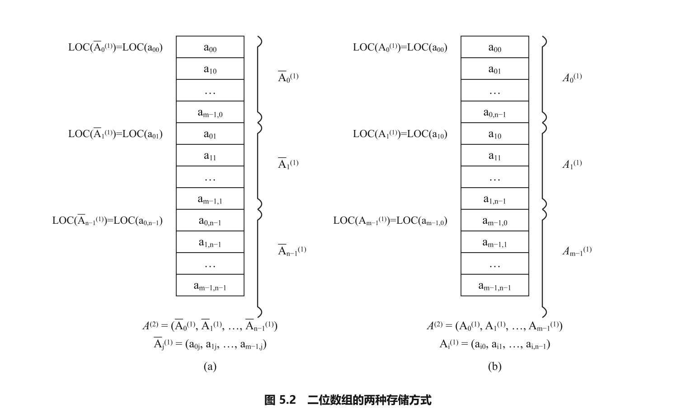
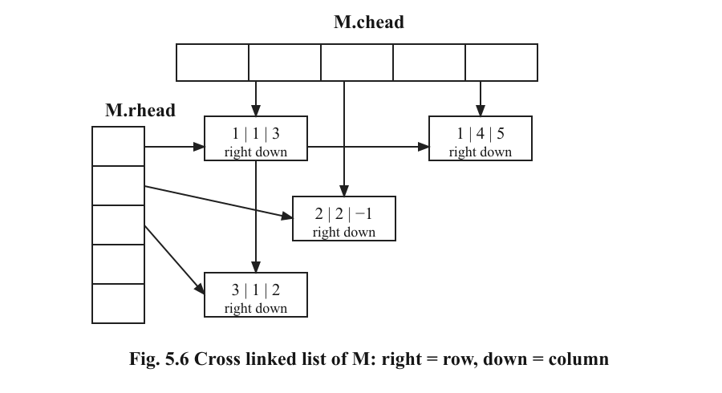
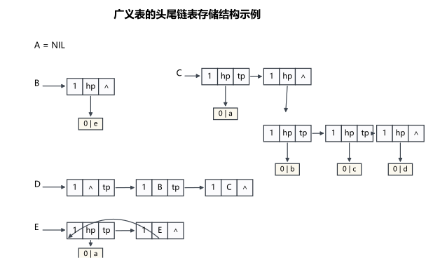

<!-- luna:source pdf_pages="100-127" book_pages="90-117" -->
# 第 5 章 数组和广义表

> **📌 本章主线**
>
> 数组把同类型元素组织成固定维数、固定维界的多维结构，并用映像函数把多维下标映射到连续存储单元。矩阵压缩存储利用元素分布规律，只保存必要的值及其位置。广义表允许元素继续是表，因而其定义、链式表示和操作都具有递归性。

> **🎯 408 复习定位**
>
> 需要会由下标计算数组地址，区分特殊矩阵与稀疏矩阵的压缩方式，手推三元组快速转置和稀疏矩阵乘法的关键状态；还要能区分广义表的表头、表尾、长度和深度，并说明递归算法的终止条件、递归分解及存储不变量。

## 本章知识地图

- 数组：固定维数与维界 → 行主序/列主序 → 映像函数 → 随机存取。
- 矩阵：规则分布用一维数组映射；无规则少量非零元用三元组、行逻辑链接顺序表或十字链表。
- 广义表：原子与子表递归嵌套 → 头尾链表/扩展线性链表 → 深度、复制和由书写串建表。

<!-- source: section="5.1" source_file="5-1-array-definition/index.md"
     pdf_pages="100-101" book_pages="90-91" items="图5.1" -->
## 5.1 数组的定义

### 数组对象、关系与边界

$n$ 维数组的数据对象为

$$
D=\left\{a_{j_1j_2\cdots j_n}\ \middle|\ n>0,\ 0\le j_i\le b_i-1,\ 1\le i\le n,\ a_{j_1j_2\cdots j_n}\in\mathrm{ElemSet}\right\}.
$$

其中，$b_i$ 是第 $i$ 维长度，$j_i$ 是第 $i$ 维下标。数组共有

$$
\prod_{i=1}^{n}b_i
$$

个同类型元素；每个元素由下标组 $(j_1,j_2,\ldots,j_n)$ 唯一确定。

第 $i$ 个关系 $R_i$ 连接只在第 $i$ 维相邻的两个元素：

$$
\begin{aligned}
R_i=\{&\langle a_{j_1\cdots j_i\cdots j_n},
a_{j_1\cdots(j_i+1)\cdots j_n}\rangle\mid\\
&0\le j_k\le b_k-1\ (k\ne i),\quad
0\le j_i\le b_i-2\}.
\end{aligned}
$$

因此，每一个 $R_i$ 单独看仍是线性关系；$n=1$ 时，数组退化为定长线性表。数组定义后，维数和维界不再改变，不进行改变结构规模的插入、删除。

### 数组的基本操作

| 操作 | 前置条件 | 结果 |
| --- | --- | --- |
| \`InitArray(&A,n,bound_1,...,bound_n)\` | 维数和各维长度合法 | 构造相应数组 |
| \`DestroyArray(&A)\` | 数组已构造 | 释放数组 |
| \`Value(A,&e,index_1,...,index_n)\` | $A$ 为 $n$ 维数组，所有下标不越界 | 用 $e$ 返回指定元素 |
| \`Assign(&A,e,index_1,...,index_n)\` | $A$ 为 $n$ 维数组，所有下标不越界 | 把 $e$ 写入指定元素 |

除初始化和销毁外，数组的核心操作是按下标读取和修改元素。

### 二维数组的递归类型视角

$m\times n$ 二维数组既可看成由 $n$ 个列向量组成的定长线性表，也可看成由 $m$ 个行向量组成的定长线性表。C 语言的类型定义

~~~c
typedef ElemType Array2[m][n];
~~~

等价于

~~~c
typedef ElemType Array1[n];
typedef Array1 Array2[m];
~~~

即二维数组是“元素类型为一维数组的一维数组”；同理，$n$ 维数组可递归定义为“元素类型为 $n-1$ 维数组的一维数组”。

<!-- source: section="5.2" source_file="5-2-array-sequential-representation/index.md"
     pdf_pages="101-105" book_pages="91-95" items="式(5-1),式(5-2),图5.2" -->
## 5.2 数组的顺序表示和实现

### 连续存储与两种主序

数组建立后，元素总数和元素关系固定，适合用一组连续存储单元表示。多维数组映射到一维存储空间时必须约定下标变化次序：

| 主序 | 连续存放次序 | 二维数组中的直观过程 |
| --- | --- | --- |
| 列主序 | 第一维下标先变化 | 先存完第 0 列，再存第 1 列 |
| 行主序 | 最后一维下标先变化 | 先存完第 0 行，再存第 1 行 |

教材所列 C、PASCAL 等语言采用行主序，FORTRAN 采用列主序；判断地址时应以题目给定的存储约定为准。

*图 5.2　二维数组的列主序与行主序存储。*

### 行主序地址映射

设每个元素占 $L$ 个存储单元。对下标从 0 开始、第二维长度为 $b_2$ 的二维数组，

$$
\operatorname{LOC}(i,j)
=\operatorname{LOC}(0,0)+(b_2i+j)L.\tag{5-1}
$$

$n$ 维数组按行主序存储时，

$$
\begin{aligned}
\operatorname{LOC}(j_1,\ldots,j_n)
={}&\operatorname{LOC}(0,\ldots,0)\\
&+\left(
\sum_{i=1}^{n-1}j_i\prod_{k=i+1}^{n}b_k+j_n
\right)L\\
={}&\operatorname{LOC}(0,\ldots,0)
+\sum_{i=1}^{n}c_i j_i.\tag{5-2}
\end{aligned}
$$

其中

$$
c_n=L,\qquad c_{i-1}=b_i c_i\quad(1<i\le n).
$$

式 (5-2) 是数组的映像函数。$c_i$ 在维界确定后成为常量，地址是各维下标的线性函数；任一合法元素都经过同样的下标检查和线性映射，因此该表示属于随机存储结构。

> **⚠ 易错提醒**
>
> 数学公式中的 $c_i$ 已包含元素长度 $L$；教材实现用元素指针做加法，\`constants\` 保存的是“元素个数偏移量”，所以令最后一维常量为 1，而不是字节数 $L$。

### 顺序存储实现要点

教材实现保存四类信息：

~~~cpp
typedef struct {
    ElemType *base;   // 元素区基址
    int dim;          // 维数
    int *bounds;      // 各维长度
    int *constants;   // 行主序映像常量
} Array;
~~~

初始化时先检查 $1\le\mathrm{dim}\le 8$，记录各维界并计算元素总数，再从最后一维向前计算

$$
\mathrm{constants}[i]
=\mathrm{bounds}[i+1]\times\mathrm{constants}[i+1].
$$

定位过程的核心为：

~~~cpp
Status Locate(Array A, va_list ap, int &off) {
    int ind;
    off = 0;
    for (int i = 0; i < A.dim; ++i) {
        ind = va_arg(ap, int);
        if (ind < 0 || ind >= A.bounds[i]) return OVERFLOW;
        off += A.constants[i] * ind;
    }
    return OK;
}
~~~

循环处理完前 $r$ 维后，不变量为

$$
\mathrm{off}=\sum_{i=0}^{r-1}\mathrm{constants}[i]\times j_i.
$$

所有维都处理完后，\`base + off\` 即目标元素地址；\`Value\` 读取该位置，\`Assign\` 写入该位置。教材代码把负维界判为 \`UNDERFLOW\`；若某维长度为 0，则该维没有合法下标，定位检查不会接受任何访问。

<!-- source: section="5.3" source_file="5-3-matrix-compressed-storage/index.md"
     pdf_pages="105-116" book_pages="95-106" items="式(5-3)至式(5-6),算法5.1至算法5.4,表5.1至表5.2,图5.3至图5.6" -->
## 5.3 矩阵的压缩存储

### 压缩存储的对象

压缩存储的目标是减少重复值和零元占用的空间：

- 多个值相同的元素只分配一个存储位置；
- 零元不分配存储位置。

若相同值或零元的分布有规律，矩阵属于特殊矩阵，可建立下标到一维存储位置的映射；若非零元少但分布无规律，则按“值 + 行列位置”保存为稀疏矩阵。

### 特殊矩阵

**对称矩阵**满足

$$
a_{ij}=a_{ji},\qquad 1\le i,j\le n.
$$

按行主序只保存下三角（含主对角线），可把 $n^2$ 个矩阵元压缩到 $n(n+1)/2$ 个位置。矩阵下标从 1 开始，而一维数组 \`sa\` 下标从 0 开始：

$$
k=
\begin{cases}
\dfrac{i(i-1)}2+j-1,&i\ge j,\\[4pt]
\dfrac{j(j-1)}2+i-1,&i<j.
\end{cases}\tag{5-3}
$$

第二个分支利用 $a_{ij}=a_{ji}$，把上三角元映射到对称的下三角元。

**三角矩阵**只保存一个三角区域（含对角线），并额外用一个位置保存另一三角区域中的统一常数 $c$ 或零，共需 $n(n+1)/2+1$ 个位置。

**带状对角矩阵**的非零元集中在主对角线及其上下若干条对角线，可按行或按对角线次序保存。关键是先明确带宽和存储次序，再建立矩阵下标与一维下标的对应关系；源文未给出统一映射式。

### 稀疏矩阵与三元组顺序表

设 $m\times n$ 矩阵有 $t$ 个非零元，稀疏因子为

$$
\delta=\frac{t}{mn}.
$$

“稀疏”没有严格统一界限；教材给出“通常认为 $\delta\le0.05$”的经验判断，不能把它当成数学定义。

稀疏矩阵由行数 $m$、列数 $n$ 和所有非零元三元组 $(i,j,a_{ij})$ 唯一确定。三元组顺序表按行主序保存非零元：

~~~c
#define MAXSIZE 12500
typedef struct {
    int i, j;
    ElemType e;
} Triple;

typedef struct {
    Triple data[MAXSIZE + 1];  // data[0] 不用
    int mu, nu, tu;            // 行数、列数、非零元数
} TSMatrix;
~~~

这种表示支持创建、销毁、输出、复制、转置；加减要求两矩阵行列数分别相等，乘法要求左矩阵列数等于右矩阵行数。其优势是按行顺序处理方便，局限是仅凭行号定位某一行时仍要从表头查找。

### 算法 5.1 与算法 5.2：转置

转置后 $T(i,j)=M(j,i)$，非零元个数不变，因此稀疏矩阵的转置仍是稀疏矩阵。三元组转置必须同时完成：

1. 交换矩阵行数与列数；
2. 交换每个三元组的 $i,j$；
3. 让结果仍按行主序排列。

| 方法 | 排列方法 | 时间复杂度 | 适用条件 |
| --- | --- | --- | --- |
| 算法 5.1 普通转置 | 依次枚举 $M$ 的每一列，每列扫描全部 $t$ 个三元组 | $O(\mathrm{nu}\cdot\mathrm{tu})$ | 只有当 $\mathrm{tu}\ll\mathrm{mu}\cdot\mathrm{nu}$ 时才可能保持优势 |
| 算法 5.2 快速转置 | 先统计每列非零元数，再一次扫描原三元组直接定位 | $O(\mathrm{nu}+\mathrm{tu})$ | 需要长度与列数同阶的辅助向量 |
| 完整二维数组转置 | 枚举每列、每行并直接交换下标 | $O(\mathrm{mu}\cdot\mathrm{nu})$ | 不利用稀疏性 |

当 $\mathrm{tu}$ 与 $\mathrm{mu}\cdot\mathrm{nu}$ 同数量级时，算法 5.1 为 $O(\mathrm{mu}\cdot\mathrm{nu}^2)$，反而慢于完整二维数组转置；算法 5.2 此时仍为 $O(\mathrm{mu}\cdot\mathrm{nu})$。

快速转置使用：

- \`num[col]\`：$M$ 第 \`col\` 列的非零元个数；
- \`cpot[col]\`：该列第一个非零元转置后在 \`T.data\` 中的位置。

$$
\begin{cases}
\mathrm{cpot}[1]=1,\\
\mathrm{cpot}[\mathrm{col}]
=\mathrm{cpot}[\mathrm{col}-1]+\mathrm{num}[\mathrm{col}-1],
&2\le\mathrm{col}\le M.\mathrm{nu}.
\end{cases}\tag{5-4}
$$

对教材的 $6\times7$ 稀疏矩阵：

| \`col\` | 1 | 2 | 3 | 4 | 5 | 6 | 7 |
| --- | ---: | ---: | ---: | ---: | ---: | ---: | ---: |
| \`num[col]\` | 2 | 2 | 2 | 1 | 0 | 1 | 0 |
| \`cpot[col]\` 初值 | 1 | 3 | 5 | 7 | 8 | 8 | 9 |

核心过程为：

~~~cpp
int col, p, q;

for (col = 1; col <= M.nu; ++col) num[col] = 0;
for (p = 1; p <= M.tu; ++p) ++num[M.data[p].j];

cpot[1] = 1;
for (col = 2; col <= M.nu; ++col)
    cpot[col] = cpot[col - 1] + num[col - 1];

for (p = 1; p <= M.tu; ++p) {
    col = M.data[p].j;
    q = cpot[col];
    T.data[q].i = M.data[p].j;
    T.data[q].j = M.data[p].i;
    T.data[q].e = M.data[p].e;
    ++cpot[col];
}
~~~

处理原表前 $p-1$ 个三元组后，\`cpot[col]\` 始终指向该列对应的目标行中“下一个空位置”。原表按行主序扫描，因此同一原列内的元素按原行号递增写入，转置表仍保持行主序。

教材实现同时使用 \`num\` 与 \`cpot\` 两个列向量，辅助空间与列数同阶；教材注释指出，调整 \`cpot\` 的计算过程后可以只占用一个向量空间。

### 行逻辑链接顺序表与稀疏矩阵乘法

行逻辑链接顺序表在三元组表之外固定保存

~~~c
int rpos[MAXRC + 1];  // 各行第一个非零元在 data 中的位置
~~~

若第 \`row\` 行不是最后一行，则其非零元范围为

$$
\mathrm{data}\big[\mathrm{rpos[row]},\ \mathrm{rpos[row+1]}-1\big];
$$

最后一行的结束位置为 \`tu\`。这使算法能直接进入任意一行。

教材的最小乘法例为

$$
\begin{aligned}
M&=\begin{pmatrix}
3&0&0&5\\
0&-1&0&0\\
2&0&0&0
\end{pmatrix},\\
N&=\begin{pmatrix}
0&2\\
1&0\\
-2&4\\
0&0
\end{pmatrix},\\
Q=M\times N&=\begin{pmatrix}
0&6\\
-1&0\\
0&4
\end{pmatrix}.
\end{aligned}\tag{5-5}
$$

其中 $N$ 的行入口为：

| \`row\` | 1 | 2 | 3 | 4 |
| --- | ---: | ---: | ---: | ---: |
| \`rpos[row]\` | 1 | 2 | 3 | 5 |

设 $M$ 为 $m_1\times n_1$，$N$ 为 $m_2\times n_2$，仅当 $n_1=m_2$ 时可计算

$$
Q(i,j)=\sum_{k=1}^{n_1}M(i,k)N(k,j).\tag{5-6}
$$

完整二维数组按三重循环计算的时间复杂度为 $O(m_1n_1n_2)$。稀疏表示不能直接套用按所有位置枚举的过程，而要只组合可能产生非零贡献的三元组。

算法 5.3 的关键是跳过必为零的乘积：

1. 逐行处理 $M$；对第 \`arow\` 行先把结果行累加器 \`ctemp[1..N.nu]\` 清零。
2. 对 $M$ 当前行的每个非零元 $(i,k,M(i,k))$，通过 \`N.rpos[k]\` 定位 $N$ 的第 $k$ 行。
3. 对该行每个 $(k,j,N(k,j))$，累加
   $\mathrm{ctemp}[j]\mathrel{+}=M(i,k)N(k,j)$。
4. 整行累加完成后才判断结果是否非零，并把非零值按列序写入 $Q$。

行处理期间的不变量是：处理完 $M$ 当前行的若干个三元组后，\`ctemp[j]\` 等于这些已处理项对 $Q(\mathrm{arow},j)$ 的部分和。必须等到整行结束后再压缩，因为多个非零乘积可能相消为零；反之，两个稀疏矩阵的乘积也可能不再稀疏。

教材给出的代价分解为：

$$
O(\mathrm{M.mu}\cdot\mathrm{N.nu})
+O\left(\frac{\mathrm{M.tu}\cdot\mathrm{N.tu}}{\mathrm{N.mu}}\right),
$$

其中第一项来自逐行清零、扫描结果列并压缩，第二项按 $\mathrm{N.tu}/\mathrm{N.mu}$ 估计所访问的每行非零元数。若 $M$ 为 $m\times n$、$N$ 为 $n\times p$，教材进一步写成

$$
O\!\left(mp(1+n\delta_M\delta_N)\right).
$$

教材在 $\delta_M<0.05$、$\delta_N<0.05$ 且 $n<1000$ 的条件下，将其视作与 $O(mp)$ 同量级的估计；这不是不附条件的最坏情况结论。若预知 $Q$ 不稀疏，应考虑直接用二维数组表示结果。

### 十字链表

当非零元的位置和个数频繁改变时，三元组顺序表的插入、删除会移动元素，适合改用十字链表。每个非零元结点同时属于一条行链和一条列链：

~~~c
typedef struct OLNode {
    int i, j;
    ElemType e;
    struct OLNode *right;  // 同行下一个非零元
    struct OLNode *down;   // 同列下一个非零元
} OLNode, *OLink;

typedef struct {
    OLink *rhead, *chead;  // 行头指针向量、列头指针向量
    int mu, nu, tu;
} CrossList;
~~~

*图 5.6　十字链表中同一结点同时参加行链和列链。*

算法 5.4 按任意次序输入三元组时，对每个新结点分别在对应行按列号、在对应列按行号寻找插入位置。对 $m\times n$ 矩阵的 $t$ 个非零元，教材给出的时间复杂度为

$$
O(t\cdot s),\qquad s=\max\{m,n\}.
$$

若三元组已按行主序输入，可改写到 $O(t)$ 数量级。

把矩阵 $B$ 加到矩阵 $A$ 时，逐行归并两条按列号有序的行链。设 \`pa\`、\`pb\` 指向当前行的结点：

| 条件 | 对 $A$ 的操作 | 必须维护的链接 |
| --- | --- | --- |
| \`pa == NULL\` 或 \`pa->j > pb->j\` | 复制 $B$ 当前结点并插入 $A$ | 同时修改行链 \`right\` 与列链 \`down\` |
| \`pa->j < pb->j\` | $A$ 当前结点保留，\`pa\` 右移 | 行、列链接不变 |
| 列号相等且元素和非零 | 把和值写回 \`pa->e\` | 链接不变 |
| 列号相等且元素和为零 | 删除 \`pa\` | 同时从行链和列链摘除 |

行链上的 \`pre\` 始终指向 \`pa\` 的前驱；列辅助指针初始满足 \`hl[j]=A.chead[j]\`，随后保存当前处理位置之前的列链结点，使插入、删除时能更新 \`down\`。逐行扫描两个十字链表的总时间复杂度为 $O(t_a+t_b)$。

### 三种稀疏矩阵表示对照

| 表示 | 关键附加信息 | 擅长操作 | 主要局限 |
| --- | --- | --- | --- |
| 三元组顺序表 | 行、列、值；整体按行主序 | 顺序处理、转置 | 定位某行需从头查找；动态插删需移动 |
| 行逻辑链接顺序表 | 三元组表 + \`rpos\` | 按行访问、稀疏矩阵乘法 | 仍是顺序表，动态插删代价未消失 |
| 十字链表 | \`right\` 行链 + \`down\` 列链 | 行列双向访问、频繁插删、矩阵相加 | 每个非零元需要两个链指针 |

<!-- source: section="5.4" source_file="5-4-generalized-list-definition/index.md"
     pdf_pages="116-118" book_pages="106-108" items="图5.7" -->
## 5.4 广义表的定义

### 递归定义与基本操作

广义表是线性表的推广：

$$
LS=(\alpha_1,\alpha_2,\ldots,\alpha_n),\qquad n\ge0,
$$

其中每个 $\alpha_i$ 可以是原子，也可以是广义表，分别称为 $LS$ 的原子和子表。由于定义中再次使用“广义表”，这是递归定义；习惯上用大写字母表示表名、小写字母表示原子。

| 操作类别 | 操作 | 结果或条件 |
| --- | --- | --- |
| 生命周期 | \`InitGList\`、\`CreateGList\`、\`DestroyGList\`、\`CopyGList\` | 建空表、由书写串建表、销毁、复制 |
| 查询 | \`GListLength\`、\`GListDepth\`、\`GListEmpty\` | 求长度、求深度、判空 |
| 分解 | \`GetHead\`、\`GetTail\` | 仅对非空表按表头/表尾分解 |
| 修改 | \`InsertFirst_GL\`、\`DeleteFirst_GL\` | 插入或删除第一个元素 |
| 遍历 | \`Traverse_GList(L,Visit)\` | 用 \`Visit\` 处理各元素 |

### 长度、表头与表尾

广义表的**长度**是最外层元素个数 $n$，不是全部原子数，也不是嵌套层数。

对非空表

$$
LS=(\alpha_1,\alpha_2,\ldots,\alpha_n),
$$

- 表头为第一个元素 $\alpha_1$，可能是原子，也可能是子表；
- 表尾为其余元素组成的表 $(\alpha_2,\ldots,\alpha_n)$，必定是广义表；
- 只有一个元素时，表尾是空表 $()$，而不是该元素本身。

### 典型广义表与三条性质

| 广义表 | 长度 | 揭示的性质 |
| --- | ---: | --- |
| $A=()$ | 0 | 空表 |
| $B=(e)$ | 1 | 单原子表 |
| $C=(a,(b,c,d))$ | 2 | 元素可为子表，形成多层结构 |
| $D=(A,B,C)$ | 3 | 子表可按名称被其他表共享 |
| $E=(a,E)$ | 2 | 表可把自身作为子表，形成递归表 |

由此得到三条结构性质：

1. 广义表是多层次结构，子表还可继续包含子表。
2. 子表可被多个广义表共享，存储时可通过同一子表地址引用。
3. 广义表可以递归地包含自身；此时书写形式虽有限，展开结果可无限。

### 空表与含空表的表

$$
\operatorname{GetHead}(B)=e,\qquad
\operatorname{GetTail}(B)=(),
$$

而

$$
\operatorname{GetHead}(D)=A,\qquad
\operatorname{GetTail}(D)=(B,C).
$$

继续分解表尾：

$$
\operatorname{GetHead}((B,C))=B,\quad
\operatorname{GetTail}((B,C))=(C),\quad
\operatorname{GetTail}((C))=().
$$

> **⚠ 易错提醒**
>
> $()$ 是长度为 0 的空表；$(())$ 是长度为 1 的非空表，它唯一的元素是空表。对 $(())$ 而言，表头与表尾都等于 $()$，但二者含义分别是“第一个元素”和“去掉第一个元素后的剩余表”。

<!-- source: section="5.5" source_file="5-5-generalized-list-storage-structure/index.md"
     pdf_pages="119-120" book_pages="109-110" items="图5.8至图5.11" -->
## 5.5 广义表的存储结构

广义表元素可能是原子，也可能是结构不同的子表，难以用固定大小的顺序存储单元统一表示，通常采用链式存储。

### 头尾链表

头尾链表用标志域区分两种结点：

~~~c
typedef enum { ATOM, LIST } ElemTag;

typedef struct GLNode {
    ElemTag tag;
    union {
        AtomType atom;
        struct {
            struct GLNode *hp;  // 表头
            struct GLNode *tp;  // 表尾
        } ptr;
    };
} *GList;
~~~

- 原子结点：\`tag=ATOM\`，联合域解释为 \`atom\`。
- 表结点：\`tag=LIST\`，\`hp\` 指向当前元素，\`tp\` 指向剩余表。

*图 5.9　头尾链表可表达空表、嵌套、共享引用与递归引用。*

### 头尾链表的不变量

1. 空表的头指针为 \`NULL\`。
2. 非空表的外部指针指向一个表结点；每个最高层表结点表示一个元素。
3. 表结点的 \`hp\` 指向该元素：它可以是原子结点，也可以是子表的表结点。
4. 表结点的 \`tp\` 指向表尾：表尾为空时为 \`NULL\`，否则仍指向表结点。
5. 最高层由 \`tp\` 串接的表结点个数等于广义表长度。

层次由 \`hp\` 向子表下降，由 \`tp\` 在同一层向后移动。共享表让多个 \`hp\` 指向同一子表；递归表则出现回指。

### 扩展线性链表

另一种表示把 \`tp\` 作为所有元素结点共有的“同层后继”：

~~~c
typedef struct GLNode {
    ElemTag tag;
    union {
        AtomType atom;
        struct GLNode *hp;
    };
    struct GLNode *tp;
} *GList;
~~~

原子结点直接保存 \`atom\`，表结点用 \`hp\` 指向子表；两者都用 \`tp\` 连接同一层的下一元素。

### 两种表示的结构差异

| 维度 | 头尾链表 | 扩展线性链表 |
| --- | --- | --- |
| 同层元素载体 | 每个元素外包一个表结点 | 原子结点或表结点本身 |
| 表头 | 表结点的 \`hp\` | 子表结点的 \`hp\` |
| 表尾/同层后继 | 表结点的 \`tp\` 指向剩余表 | 每个结点的 \`tp\` 指向下一元素 |
| 原子结点是否有 \`tp\` | 否 | 是 |

两种结构都能表示广义表；后续算法 5.5—5.8采用头尾链表。

<!-- source: section="5.6" source_file="5-6-m-polynomial-representation/index.md"
     pdf_pages="120-122" book_pages="110-112" items="式(5-7),图5.12" -->
## 5.6 $m$ 元多项式的表示

### 为什么使用广义表

若用普通线性表表示 $m$ 元多项式，每项都保存一个系数和 $m$ 个指数，会遇到：

1. 各项实际含有的变元数不同，固定分配 $m$ 个指数域会浪费空间；
2. 按实际变元数分配又会导致结点大小不一致；
3. 不同 $m$ 的多项式需要不同大小的结点，存储管理不统一。

而同一因子在多项式中可能重复出现，适合按主变元逐层提取公共结构。

### 逐层选取主变元

教材示例为

$$
P(x,y,z)=x^{10}y^3z^2+2x^6y^3z^2+3x^5y^2z^2
+x^4y^4+6x^3y^4+2yz+15.
$$

按 $z$、$y$、$x$ 逐层分组：

$$
P(x,y,z)=((x^{10}+2x^6)y^3+3x^5y^2)z^2
+((x^4+6x^3)y^4+2y)z+15.
$$

广义表表示为

$$
\begin{aligned}
P&=z((A,2),(B,1),(15,0)),\tag{5-7}\\
A&=y((C,3),(D,2)),\\
C&=x((1,10),(2,6)),\\
D&=x((3,5)),\\
B&=y((E,4),(F,1)),\\
E&=x((1,4),(6,3)),\\
F&=x((2,0)).
\end{aligned}
$$

每层先写该层变元，再列出“系数—指数”偶对；系数还可以是下一层多项式。按这种表示逐层下降时，广义表深度等于变元个数。

### 多项式结点

结点在扩展线性链表基础上增加指数域：

~~~c
typedef struct MPNode {
    ElemTag tag;
    int exp;
    union {
        float coef;
        struct MPNode *hp;
    };
    struct MPNode *tp;
} *MPList;
~~~

| 结点类型 | \`tag\` | \`exp\` | 联合域 | \`tp\` |
| --- | --- | --- | --- | --- |
| 表结点 | \`LIST\` | 当前项指数；层表头处还用于指示变元 | \`hp\` 指向系数子表 | 同层下一项 |
| 原子结点 | \`ATOM\` | 当前项指数 | \`coef\` 保存系数 | 同层下一项 |

每层增设表头结点，并把所有变元放入一维数组；层表头的 \`exp\` 保存对应变元在该数组中的下标，根表头的 \`exp=3\` 表示示例含 3 个变元。普通项结点的 \`exp\` 才表示该项在本层主变元上的指数。

<!-- source: section="5.7" source_file="5-7-generalized-list-recursive-algorithms/index.md"
     pdf_pages="122-127" book_pages="112-117" items="算法5.5至算法5.8,图5.13" -->
## 5.7 广义表的递归算法

### 递归设计的统一框架

递归定义包含：

- **基本项**：无需继续递归即可直接求解的终结状态；
- **归纳项**：把原问题分解为性质相同、规模更小的子问题，并说明如何由子问题结果合成原问题结果。

设计递归函数时先明确接口和功能。分析函数体中的递归调用时，可把“接口相同的调用能够完成规格说明”当作归纳假设，再检查当前层的分解、合成和终止条件。

> **🧭 条件与边界**
>
> 本节算法 5.5—5.8只讨论**非递归表且无共享子表**的广义表。5.4 节允许的自引用表和共享子表不满足这里的前提；直接套用递归遍历可能不能终止，复制也不能保持共享关系。

### 算法 5.5：求广义表深度

深度定义为广义表书写形式中括号的重数：

$$
\begin{array}{lll}
\text{基本项：}&\operatorname{DEPTH}(LS)=1,&LS\text{ 为空表},\\
&\operatorname{DEPTH}(LS)=0,&LS\text{ 为原子},\\
\text{归纳项：}&\operatorname{DEPTH}(LS)
=1+\max\limits_{1\le i\le n}\operatorname{DEPTH}(a_i),
&LS=(a_1,\ldots,a_n),\ n\ge1.
\end{array}
$$

头尾链表实现：

~~~cpp
int GListDepth(GList L) {
    if (!L) return 1;
    if (L->tag == ATOM) return 0;
    int max = 0;
    for (GList pp = L; pp; pp = pp->ptr.tp) {
        int dep = GListDepth(pp->ptr.hp);
        if (dep > max) max = dep;
    }
    return max + 1;
}
~~~

外层循环的不变量是：\`max\` 等于已经处理的最高层元素深度的最大值。递归调用求当前 \`hp\` 所指元素的深度，\`tp\` 推进到下一最高层元素；最后加 1 计入当前表的一层括号。该过程本质上遍历整张无共享、无环的广义表结构。

最小例：

$$
D=(A,B,C)=((),(e),(a,(b,c,d))).
$$

有

$$
\operatorname{DEPTH}(A)=1,\quad
\operatorname{DEPTH}(B)=1,\quad
\operatorname{DEPTH}(C)=2,
$$

所以

$$
\operatorname{DEPTH}(D)=1+\max\{1,1,2\}=3.
$$

### 算法 5.6：复制广义表

非空广义表由表头和表尾唯一确定，因此深复制可递归地“复制表头 + 复制表尾”：

~~~cpp
Status CopyGList(GList &T, GList L) {
    if (!L) {
        T = NULL;
    } else {
        if (!(T = (GList)malloc(sizeof(GLNode)))) exit(OVERFLOW);
        T->tag = L->tag;
        if (L->tag == ATOM) {
            T->atom = L->atom;
        } else {
            CopyGList(T->ptr.hp, L->ptr.hp);
            CopyGList(T->ptr.tp, L->ptr.tp);
        }
    }
    return OK;
}
~~~

后置条件是：新结构中的每个结点与原结构对应，但地址不同；原子值相同，表头/表尾关系保持一致。空指针直接复制为 \`NULL\`，原子结点只复制值，表结点分别递归复制两个指针域所代表的结构。

> **🔎 源文/转写疑点**
>
> 算法 5.6 后的文字称该函数“使用了变参”，但给出的函数签名 \`CopyGList(GList &T, GList L)\` 并非变参接口。本页只保留可由函数签名和递归体确定的复制语义，不推测原句意图。

### 算法 5.7、5.8：由书写串建立广义表

广义表递归操作有两种分解视角：一是分成“表头 + 表尾”，算法 5.6 采用这一视角；二是看成由 $n$ 个并列元素组成，逐一处理各元素，算法 5.5 和本节建表过程采用这一视角。由书写串建表也可仿照表头/表尾递归实现，教材在算法 5.7 中展开的是并列元素方法。

算法假设输入书写串合法，并约定原子是长度为 1 的单字符。设输入为 $S$：

- $S=\text{"()"}$：基本项，建立空表；
- $S$ 长度为 1：基本项，建立原子结点；
- $S=(s_1,s_2,\ldots,s_n)$：去掉最外层括号，依次为每个顶层子串 $s_i$ 建表结点，并递归建立其 \`hp\`；各表结点由 \`tp\` 串接，末结点 \`tp=NULL\`。

~~~pseudo
CreateGList(S):
    if S == "()":
        return NULL
    if length(S) == 1:
        return AtomNode(S)

    sub = S 去掉最外层括号
    head = tail = NULL
    while sub 非空:
        (hsub, sub) = sever(sub)
        cell = ListNode(hp = CreateGList(hsub), tp = NULL)
        把 cell 接到当前最高层链的末尾
    return head
~~~

\`sever(str,hstr)\` 不能在子表内部的逗号处分割。扫描时令 $k$ 为“尚未配对的左括号数”：

~~~pseudo
i = 0; k = 0
repeat:
    i = i + 1
    ch = str[i]
    if ch == '(' then k = k + 1
    if ch == ')' then k = k - 1
until i 到达串尾，或 (ch == ',' 且 k == 0)

若找到顶层逗号:
    hstr = 逗号左侧子串
    str  = 逗号右侧剩余串
否则:
    hstr = 原 str
    str  = 空串
~~~

扫描前缀期间的不变量是：$k$ 等于该前缀中未匹配的左括号数；只有 $k=0$ 的逗号才分隔当前广义表的同层元素。算法不处理非法括号、非法逗号或多字符原子，这些均在其输入前提之外。

## 章末对照

| 维度 | 数组 | 广义表 |
| --- | --- | --- |
| 元素类型 | 所有元素同类型 | 元素可为原子或子表 |
| 规模 | 定义后维数、维界固定 | 可通过链式结点递归扩展 |
| 核心表示 | 连续存储 + 下标映像 | 带标志域的链式结点 |
| 访问方式 | 由完整下标组直接映射 | 沿 \`hp\` 下探、沿 \`tp\` 同层推进 |
| 典型应用 | 多维数组、矩阵压缩 | 嵌套列表、$m$ 元多项式、递归处理 |
| 关键边界 | 下标范围、主序、基址、元素长度 | 空表、原子/子表、表头/表尾、共享与环 |

> **⚠ 易错提醒**
>
> 对称矩阵映射式同时使用“矩阵下标从 1 开始”和“一维数组下标从 0 开始”；快速转置中的 \`cpot\` 在写入后会自增；稀疏矩阵乘积必须等一整行累加结束后才能判零；广义表的表尾永远是表，长度与深度不是同一量。

## 复习闭环

- 能否由 $(j_1,\ldots,j_n)$ 写出行主序地址，并解释每个 $c_i$？
- 能否说明算法 5.1 与算法 5.2 的顺序、辅助数组和复杂度差异？
- 能否用 \`rpos\` 找到一行的三元组范围，并说明 \`ctemp\` 的不变量？
- 能否同时维护十字链表的 \`right\`、\`down\`，区分插入、保留、改值和删除？
- 能否区分 $()$、$(())$、表头、表尾、长度与深度？
- 能否为深度、复制、建表分别写出基本项、归纳项及适用前提？

