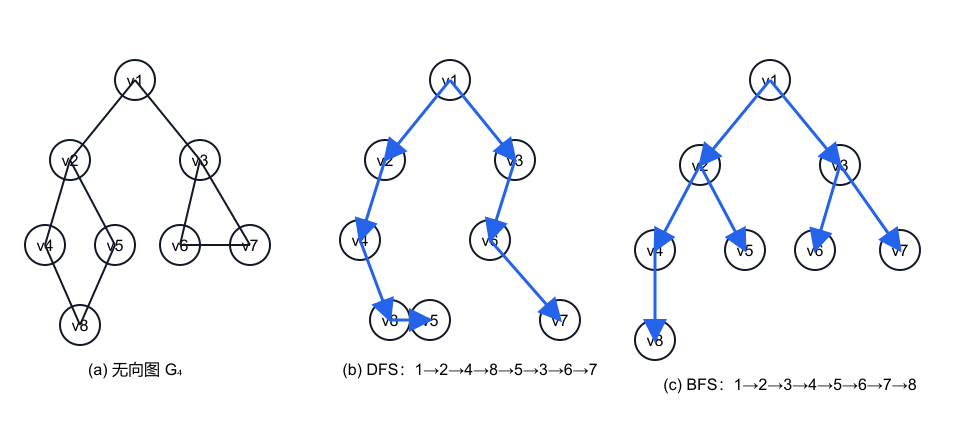
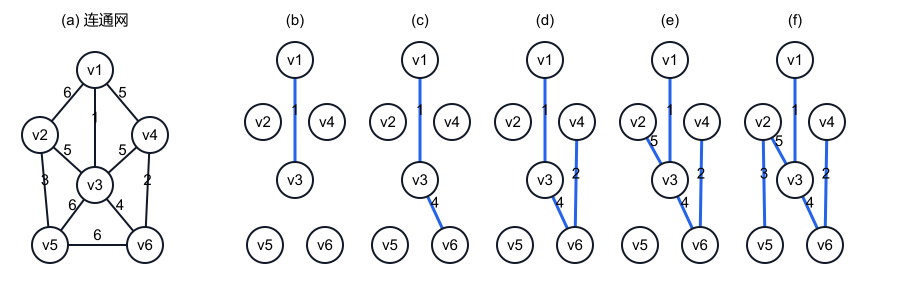
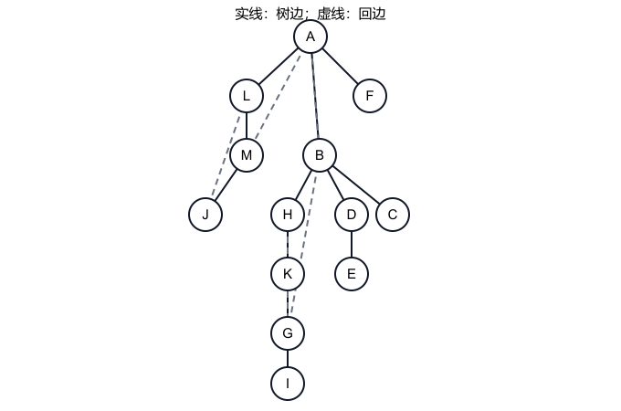

<!-- luna:source pdf_pages="166-202" book_pages="156-192" -->
# 第 7 章 图

> **📌 本章主线**
>
> 图用顶点集合与顶点间关系描述任意关联。复习时应沿“术语与条件 → 存储表示 → DFS/BFS → 连通性与生成结构 → DAG 应用 → 最短路径”推进：先确认有向/无向、带权/无权、连通性和权值语义，再选择与操作相匹配的表示和算法。

> **🎯 408 复习定位**
>
> 需要会判断度、路径、连通分量和生成树；会读写邻接矩阵、邻接表、十字链表与邻接多重表；会手推 DFS、BFS、Prim、Kruskal、拓扑排序、关键路径、Dijkstra 和 Floyd，并说明不变量、边界与复杂度。

## 本章知识地图

| 问题 | 核心对象 | 关键状态 | 典型代价 |
| --- | --- | --- | --- |
| 表示顶点关系 | 邻接矩阵、邻接表、十字链表、邻接多重表 | 边/弧在结构中的落点 | 矩阵 $O(n^2)$ 空间；链式表示 $O(n+e)$ 空间 |
| 访问全部顶点 | DFS、BFS | **visited** 与递归栈/队列 | 邻接矩阵 $O(n^2)$；邻接表 $O(n+e)$ |
| 分析连通性 | 连通分量、强连通分量、生成森林、关节点 | 完成次序、转置图、**disc/low** | 邻接表上 $O(n+e)$ |
| 构造最小生成树 | Prim、Kruskal | 割上的最小边；无环森林 | $O(n^2)$；$O(e\log e)$ |
| 安排有先后约束的活动 | 拓扑排序、关键路径 | 入度、拓扑序、$ve/vl$ | $O(n+e)$ |
| 求最短路径 | BFS、Dijkstra、Floyd | 层次、已定型集合、允许的中间点集 | $O(n+e)$、$O(n^2)$、$O(n^3)$ |

## 7.1 图的定义和术语

<!-- source: section="7.1" source_file="07-01-graph-definition-and-terms/index.md"
     pdf_pages="166-170" book_pages="156-160" items="图7.1-图7.6, ADT Graph" -->

### 基本模型与操作

图记为 $G=(V,VR)$。教材约定 $V$ 是有穷非空顶点集，$VR$ 是顶点之间关系的集合。

- 若 $\langle v,w\rangle\in VR$，它表示从 $v$ 到 $w$ 的弧；$v$ 是弧尾（初始点），$w$ 是弧头（终端点），这样的图是有向图。
- 若 $VR$ 对称，即 $\langle v,w\rangle\in VR$ 必有 $\langle w,v\rangle\in VR$，可用无序对 $(v,w)$ 表示一条边，这样的图是无向图。
- 本章不考虑顶点到自身的弧或边，即关系中的两个端点不同。

教材的 ADT Graph 将操作分为四组：

| 操作组 | 代表操作 | 前置条件与结果 |
| --- | --- | --- |
| 生命周期 | CreateGraph、DestroyGraph | 由顶点集和关系集构造图；图存在时销毁 |
| 顶点访问 | LocateVex、GetVex、PutVex | 定位顶点、读取或修改顶点值 |
| 邻接迭代 | FirstAdjVex、NextAdjVex | 返回人为排列中的第一个/下一个邻接点；无后继时返回“空” |
| 修改与遍历 | Insert/DeleteVex、Insert/DeleteArc、DFS/BFS | 删除顶点时同时删关联弧；无向图增删一条边时需同步处理两个方向；遍历应对每个顶点调用访问函数一次 |

图的逻辑结构没有天然的顶点全序，邻接点之间也没有天然次序。存储时给出的顶点序号和邻接表次序都是人为安排；它们会影响 DFS、BFS 和拓扑排序的输出次序，却不改变图本身。

### 边数、权与子图

设顶点数为 $n$，边或弧数为 $e$。在本章排除自环的条件下：

| 图类型 | $e$ 的范围 | 达到上界时 |
| --- | --- | --- |
| 无向图 | $0\le e\le \dfrac{n(n-1)}2$ | 完全图 |
| 有向图 | $0\le e\le n(n-1)$ | 有向完全图 |

教材以 $e<n\log n$ 作为“边很少”的示例来说明稀疏图，反之称稠密图；这一阈值是教材给出的描述性口径，不是存储结构选择的唯一判据。

边或弧所附的数称为权，可表示距离或耗费；带权图称为网。若 $G'=(V',E')$ 满足 $V'\subseteq V$ 且 $E'\subseteq E$，则 $G'$ 是 $G$ 的子图。

### 邻接、度与握手关系

无向图中，若 $(v,v')\in E$，则 $v$ 与 $v'$ 互为邻接点，该边依附于两个端点。顶点 $v$ 的度 $TD(v)$ 是依附于它的边数。

有向图中，若 $\langle v,v'\rangle\in A$，则 $v$ 邻接到 $v'$，$v'$ 邻接自 $v$。以 $v$ 为头的弧数是入度 $ID(v)$，以 $v$ 为尾的弧数是出度 $OD(v)$，总度满足

$$
TD(v)=ID(v)+OD(v).
$$

无论将无向边计入两个端点，还是将有向弧分别计入弧尾和弧头，均有

$$
\sum_{i=1}^{n}TD(v_i)=2e,
\qquad
e=\frac12\sum_{i=1}^{n}TD(v_i).
$$

对有向图还可直接由定义得到 $\sum ID(v_i)=\sum OD(v_i)=e$。

### 路径、环与连通性

从 $v$ 到 $v'$ 的路径是顶点序列

$$
(v=v_{i,0},v_{i,1},\ldots,v_{i,m}=v'),
$$

其中相邻顶点间有对应的边；有向图还要求每一步方向与弧方向一致。路径长度是经过的边或弧数，带权问题另以权值和作为长度。

- 首尾顶点相同的路径称为回路或环。
- 顶点不重复的路径称为简单路径。
- 除首尾外其余顶点不重复的回路称为简单回路。
- 无向图中两点间存在路径，称两点连通；任意两点连通的图是连通图。
- 无向图的连通分量是极大连通子图。“极大”表示不能再加入原图中的顶点而保持连通，不是顶点数最大的一个。
- 有向图中任意两个不同顶点都能双向到达，称强连通图；极大强连通子图称强连通分量。

### 生成树、生成森林及边数判定

连通图的生成树是包含全部 $n$ 个顶点的极小连通子图，恰有 $n-1$ 条边。这里“极小”指再删任一树边都会失去连通性。

- 给生成树再加一条边，两个端点间出现第二条路径，必形成环。
- $n$ 个顶点且边数小于 $n-1$ 的图必不连通。
- $n$ 个顶点且边数大于 $n-1$ 的图必有环。
- 恰有 $n-1$ 条边只是树的必要条件；若图不连通，它仍不是生成树。

教材将恰有一个顶点入度为 $0$、其余顶点入度均为 $1$ 的有向结构称为有向树；覆盖全部顶点的若干棵不相交有向树构成有向图的生成森林。

> **⚠ 易错提醒**
>
> “连通”用于无向图；有向图对应“强连通”。生成树要求同时满足覆盖全部顶点、连通和无环，不能只凭边数 $n-1$ 判定。

## 7.2 图的存储结构

<!-- source: section="7.2" source_file="07-02-graph-storage/index.md"
     pdf_pages="170-177" book_pages="160-167" items="图7.7-图7.12, 算法7.1-算法7.3" -->

图中任意两个顶点都可能相关，不能像线性表那样仅靠元素物理邻接表达逻辑关系。数组可显式存关系，链式结构则按边或弧组织指针。选择表示时应先看图的有向性、稠密度，以及主要操作是判边、枚举邻接点，还是频繁修改边。

### 四类表示总览

| 表示 | 适用对象 | 一条边/弧的记录方式 | 主要优势 | 主要代价 |
| --- | --- | --- | --- | --- |
| 邻接矩阵 | 各类图 | 矩阵的一个或两个单元 | 判定两点是否相邻为 $O(1)$；易求度 | 空间固定为 $O(n^2)$，枚举一个顶点的邻接点需扫一行 |
| 邻接表 | 各类图 | 有向弧一个表结点；无向边两个表结点 | 稀疏图空间 $O(n+e)$；易枚举出边 | 判定指定边需查链表；有向图入度不直接可得 |
| 十字链表 | 有向图 | 一个弧结点同时进入同头链和同尾链 | 入弧、出弧都易枚举 | 结点字段和链接维护较多 |
| 邻接多重表 | 无向图 | 一个边结点同时进入两个端点链 | 标记、删除一条边只处理一个边结点 | 遍历时必须依据当前端点选择对应链域 |

### 邻接矩阵

邻接矩阵用顶点向量保存顶点信息，用 $n\times n$ 矩阵保存关系。无权图可取

$$
A[i][j]=
\begin{cases}
1,&\langle v_i,v_j\rangle\text{ 或 }(v_i,v_j)\text{ 存在},\\
0,&\text{否则}.
\end{cases}
$$

网可取

$$
A[i][j]=
\begin{cases}
w_{ij},&\langle v_i,v_j\rangle\text{ 或 }(v_i,v_j)\text{ 存在},\\
\infty,&\text{否则}.
\end{cases}
$$

无向图矩阵对称，可只压缩存储上三角或下三角。对无向图，$v_i$ 的度是第 $i$ 行（或列）中表示边存在的元素数；对有向图，第 $i$ 行对应出度，第 $i$ 列对应入度。循环边界必须是当前顶点数 **vexnum**，不能把容量上限 **MAX_VERTEX_NUM** 当作实际 $n$。

教材算法 7.1 按图种类分派构造函数；算法 7.2 构造无向网时先以 $\infty$ 初始化矩阵，再对每条输入边定位两个端点、写入 $A[i][j]$，并令 $A[j][i]=A[i][j]$ 保持对称。若端点需在线性顶点向量中定位，教材给出的时间为

$$
O(n^2+en);
$$

其中 $O(n^2)$ 来自初始化。若输入已直接给出顶点下标，定位项可省，构造为 $O(n^2+e)$。

> **🧭 哨兵约定**
>
> “无边”的 $\infty$ 与“长度为 0 的自身路径”不是同一概念。源文一般网矩阵以 $\infty$ 表示无弧，而 Floyd 示例把对角线置为 $0$；进入具体算法前必须明确对角线和不可达哨兵的含义。

### 邻接表与逆邻接表

邻接表为每个顶点建立一个单链表。表头结点含顶点数据 **data** 和首弧指针 **firstarc**；弧结点含邻接顶点下标 **adjvex**、下一弧指针 **nextarc** 和可选信息 **info**。

无向图有 $n$ 个表头结点和 $2e$ 个边表结点；有向图有 $n$ 个表头结点和 $e$ 个弧结点。无向图中第 $i$ 条链的结点数就是 $TD(v_i)$；有向图中它只给出 $OD(v_i)$，求 $ID(v_i)$ 需扫描全部链表。

逆邻接表把以 $v_i$ 为弧头的弧链接在第 $i$ 条链上，因而便于枚举入弧。建立邻接表或逆邻接表时：

- 顶点信息就是下标，可直接定位，时间为 $O(n+e)$；
- 否则每条边端点都要查找位置，教材给出 $O(ne)$。

已知顶点 $v_i$ 时，枚举其全部邻接点为 $O(\deg(v_i))$；判断指定的 $(v_i,v_j)$ 是否存在，要在相关链上搜索，不如矩阵的 $O(1)$ 判边。

### 十字链表

十字链表把有向图的邻接表与逆邻接表合并。每个弧结点包含：

| 字段 | 含义 |
| --- | --- |
| **tailvex、headvex** | 弧尾、弧头顶点在顶点向量中的位置 |
| **tlink** | 下一条弧尾相同的弧 |
| **hlink** | 下一条弧头相同的弧 |
| **info** | 弧的附加信息 |

每个顶点结点包含 **data、firstout、firstin**，分别保存顶点信息、第一条出弧和第一条入弧。一个弧结点同时属于一条同尾链和一条同头链，因此出度、入度及其弧都容易取得。

算法 7.3 的头插不变量是：新弧 $\langle v_i,v_j\rangle$ 的 **tlink** 先接原 **firstout[i]**，**hlink** 先接原 **firstin[j]**，再令两个表头指针都指向新结点；任一侧漏更新都会破坏另一种遍历。建立时间与邻接表相同，定位成本按输入是否直接给下标而定。

### 邻接多重表

邻接多重表用于无向图。每条边只建一个结点，字段为：

| 字段 | 含义 |
| --- | --- |
| **mark** | 边是否已被搜索等状态 |
| **ivex、jvex** | 两个端点的位置 |
| **ilink、jlink** | 分别指向下一条依附于对应端点的边 |
| **info** | 边的附加信息 |

顶点结点含 **data** 和 **firstedge**。边结点同时挂入两个端点的链；沿某顶点的链移动时，当前顶点若等于 **ivex** 就取 **ilink**，若等于 **jvex** 就取 **jlink**。

邻接表用两个结点表示一条无向边，删除或标记同一条边时必须同步找到两份记录；邻接多重表只有一份边记录，更适合以“边”为操作对象。两者渐近空间均为 $O(n+e)$。

## 7.3 图的遍历

<!-- source: section="7.3" source_file="07-03-graph-traversal/index.md"
     pdf_pages="177-180" book_pages="167-170" items="图7.13, 算法7.4-算法7.6" -->

图的遍历是从某一顶点出发访问其余顶点，并使每个顶点只被访问一次。由于图可能有环，也可能从当前起点无法到达全部顶点，算法必须同时使用访问标记和覆盖全部顶点的外层循环。

### 深度优先搜索

DFS 访问顶点后，沿一个未访问邻接点继续深入；当前顶点没有未访问邻接点时回溯。算法 7.4、7.5 的核心可压缩为：

~~~text
DFS(v):
    visited[v] = true; Visit(v)
    for each w in Adj(v):
        if not visited[w]:
            DFS(w)

for v = 0 .. n-1:
    if not visited[v]:
        DFS(v)
~~~

不变量是：进入 **DFS(v)** 时立刻标记 $v$；递归边只指向当时未访问的顶点。因此每个顶点至多进入一次递归，递归边构成深度优先生成树；外层每次选择新的未访问顶点时开始生成森林中的新树。

### 广度优先搜索

BFS 先访问起点的所有未访问邻接点，再按“先发现者的邻接点先处理”的顺序逐层扩展，因此需要队列。算法 7.6 的核心为：

~~~text
for each not-yet-visited start:
    visited[start] = true; Visit(start); enqueue(start)
    while queue is not empty:
        u = dequeue()
        for each w in Adj(u):
            if not visited[w]:
                visited[w] = true
                Visit(w)
                enqueue(w)
~~~

标记必须发生在入队时，而不是出队时；否则同一顶点可能被多个前驱重复入队。对无权图，从源点进行 BFS 时，首次发现顶点的层数就是从源点到它所含边数最少的路径长度。

图 7.13 的邻接次序下，DFS 序列为

$$
v_1,v_2,v_4,v_8,v_5,v_3,v_6,v_7,
$$

BFS 序列为

$$
v_1,v_2,v_3,v_4,v_5,v_6,v_7,v_8.
$$

改变起点、顶点扫描次序或邻接点次序，都可能得到另一条合法序列。

### 遍历复杂度与边界

| 存储 | 查找全部邻接点的总代价 | DFS/BFS 时间 |
| --- | --- | --- |
| 邻接矩阵 | 每个顶点扫描一整行 | $O(n^2)$ |
| 邻接表 | 无向边被看两次、有向弧被看一次 | $O(n+e)$ |

访问数组占 $O(n)$ 空间；DFS 的递归栈最深可达 $O(n)$，BFS 队列最多容纳 $O(n)$ 个顶点。对不连通无向图或不能从首个顶点到达全部顶点的有向图，若目标是“遍历整图”，不能删掉外层循环。

## 7.4 图的连通性问题

<!-- source: section="7.4" source_file="07-04-connectivity/index.md"
     pdf_pages="180-188" book_pages="170-178" items="图7.14-图7.20, 算法7.7-算法7.11" -->

### 连通分量、生成树与生成森林

无向连通图从任一顶点执行一次 DFS 或 BFS 即可访问全部顶点。非连通图中，外层循环每次从新的未访问顶点开始，所得顶点集恰是一个连通分量。

遍历边集合 $T(G)$ 与未采用边集合 $B(G)$ 划分原图边集。对连通图，$T(G)$ 与全部顶点构成生成树；DFS 得到深度优先生成树，BFS 得到广度优先生成树。对非连通图，各分量的生成树合成生成森林。

算法 7.7、7.8 用孩子—兄弟链表存 DFS 生成森林：

- 森林中第一棵树的根作为结构根，其余分量的根依次接到根的兄弟链；
- 对顶点 $v$，第一个未访问邻接点成为最左孩子，其余未访问邻接点依次成为右兄弟；
- 每条树边对应一次首次发现，时间与 DFS 相同。

### 有向图的强连通分量

教材给出的两遍 DFS 方法如下：

1. 在原图 $G$ 上沿出弧 DFS，按顶点退出 DFS 的先后记录完成序列 **finished**。
2. 构造转置图 $G_r$，把每条 $\langle v_i,v_j\rangle$ 反向为 $\langle v_j,v_i\rangle$。
3. 按原图完成时间递减的次序，在 $G_r$ 上从尚未访问的顶点启动 DFS；每棵 DFS 树的顶点集就是 $G$ 的一个强连通分量。

第一遍确定分量间的完成次序，第二遍通过反向边把一次搜索限制在同一强连通分量内。十字链表可直接沿 **firstin/hlink** 访问反向弧；显式建立转置邻接表也需 $O(n+e)$。总时间与遍历相同。

### 最小生成树与 MST 性质

最小生成树问题的输入是连通无向网。生成树代价是其 $n-1$ 条边的权值和，目标是使该和最小。

设 $U$ 是 $V$ 的非空真子集。在所有一端位于 $U$、另一端位于 $V-U$ 的边中，若 $\{u,v\}$ 权值最小，则存在一棵包含它的最小生成树。这是教材的 MST 性质。

证明骨架是交换论证：把 $\{u,v\}$ 加入任一最小生成树 $T$ 会形成环；环上还存在另一条跨越同一割的边 $\{u',v'\}$。删去后者得到生成树 $T'$，且

$$
w(u,v)\le w(u',v')
\Longrightarrow
w(T')\le w(T).
$$

故至少有一棵最小生成树可以包含所选最小割边。

#### Prim 算法（算法 7.9）

Prim 始终维护已纳入顶点集 $U$ 和连接 $U$ 到 $V-U$ 的当前最小候选边。对每个 $v_i\notin U$：

$$
\mathrm{closedge}[i].\mathrm{lowcost}
=
\min\{w(u,v_i)\mid u\in U\},
$$

**adjvex** 记录取得该值的 $U$ 中端点。

1. 从任意 $u_0$ 开始，令 $U=\{u_0\}$。
2. 在所有未纳入顶点的 **lowcost** 中选最小者 $v_k$，加入边 $(\mathrm{adjvex}[k],v_k)$ 并令 $v_k\in U$。
3. 只用新顶点 $v_k$ 的关联边更新其余候选值。
4. 重复 $n-1$ 次。

邻接矩阵实现每轮用 $O(n)$ 选最小值并用 $O(n)$ 更新，执行 $n-1$ 轮，时间为 $O(n^2)$，与 $e$ 无关，适合稠密网。教材代码用 **lowcost=0** 兼作“已纳入 $U$”标记；若权值本身可能为 $0$，实现时应另设 **inU**，避免哨兵与合法权值冲突。

#### Kruskal 算法

Kruskal 从含 $n$ 个孤立顶点的森林开始，按权值非降次序扫描边：

1. 若边的两个端点属于不同连通分量，就加入该边并合并两分量。
2. 若两个端点已在同一分量，加入会形成环，故舍弃。
3. 收集到 $n-1$ 条边时得到最小生成树。

算法不变量是“已选边始终构成无环森林”。用按权排序的边集和并查集维护分量，教材给出的时间为 $O(e\log e)$，相对适合稀疏网。

| 对比项 | Prim | Kruskal |
| --- | --- | --- |
| 生长单位 | 每次纳入一个顶点和一条割边 | 每次合并两个分量 |
| 中间结构 | 一棵不断扩展的树 | 多棵树组成的森林 |
| 防环方式 | 新顶点来自 $V-U$ | 并查集判两端点是否同组 |
| 教材实现时间 | $O(n^2)$ | $O(e\log e)$ |

### 关节点与重连通

删去顶点 $v$ 及其关联边后，若原连通分量分裂成两个或更多连通分量，则 $v$ 是关节点（割点）。没有关节点的连通图称为重连通图；教材指出其中任意一对顶点之间至少存在两条路径。教材把“至少删去 $k$ 个顶点才会破坏连通性”的 $k$ 称为连通度。

在无向连通图的 DFS 树上，令 **disc[v]**（源文记 **visited[v]**）为首次访问次序，定义

$$
\operatorname{low}(v)=
\min
\begin{cases}
\operatorname{disc}(v),\\
\operatorname{low}(w),&w\text{ 是 }v\text{ 的 DFS 树孩子},\\
\operatorname{disc}(k),&v\text{ 的子树可由回边到达祖先 }k.
\end{cases}
$$

它表示 $v$ 的子树经若干树边并至多利用一条回边能够到达的最早祖先次序。关节点分两类：

1. DFS 树根至少有两棵子树，则根是关节点。
2. 非根顶点 $v$ 存在孩子 $w$，满足

   $$
   \operatorname{low}(w)\ge \operatorname{disc}(v),
   $$

   则 $w$ 的子树无法绕过 $v$ 到达 $v$ 的祖先，故 $v$ 是关节点。

图 7.20 对应的原图中，根 $A$ 有多棵 DFS 子树；$B、D、G$ 均有孩子子树不能借回边越过自己到达祖先，因此 $A、B、D、G$ 是关节点。

**low** 必须在孩子 DFS 返回后更新，因此计算次序是 DFS 树的后序。根要单独按孩子数判定，不能套用非根条件。算法 7.10、7.11 本质仍是一次 DFS，邻接表上为 $O(n+e)$；源文只说明可在此基础上输出重连通分量，没有给出完整输出算法。

源文算法 7.11 为简化实现，没有把指向双亲的树边从“已访问邻接点”分支中单独排除，并说明这不影响本节的关节点判定；阅读该代码时应连同根结点特判和 $\operatorname{low}(w)\ge\operatorname{disc}(v)$ 条件一起理解。

## 7.5 有向无环图及其应用

<!-- source: section="7.5" source_file="07-05-directed-acyclic-graph/index.md"
     pdf_pages="189-196" book_pages="179-186" items="图7.21-图7.32, 式(7-1)-式(7-3), 算法7.12-算法7.14" -->

有向无环图（DAG）是不含有向环的有向图。它既能共享表达式中的公共子式，也能描述活动间的先后约束。教材表达式

$$
((a+b)\cdot(b\cdot(c+d))+(c+d)\cdot e)\cdot((c+d)\cdot e)
$$

中，$(c+d)$ 与 $(c+d)e$ 重复出现；表达式树会重复保存它们，DAG 则让多个父结点指向同一公共子式。

在有向图 DFS 中，“遇到已访问顶点”本身不足以判环；只有从当前仍未结束的 DFS 路径上的后代指回祖先，才形成有向环。实现时通常需区分未访问、正在搜索、已完成三种状态，或等价地检查目标是否仍在当前递归路径上。

### 偏序、全序与 AOV 网

集合上的关系若自反、反对称且传递，称偏序；若任意两个元素都可比较，称全序。把偏序中的先后约束扩展成一个线性次序，就是拓扑排序；所得次序称拓扑序。

AOV 网以顶点表示活动，以弧 $\langle i,j\rangle$ 表示活动 $i$ 必须先于活动 $j$：

- 若 $i$ 到 $j$ 有路径，$i$ 是 $j$ 的前驱，$j$ 是 $i$ 的后继；
- 若直接有弧 $\langle i,j\rangle$，二者是直接前驱、直接后继；
- AOV 网不应有环，否则活动会经约束链要求自己先于自己。

### 拓扑排序（算法 7.12）

基于入度的算法反复执行：

1. 选一个入度为 $0$ 的顶点输出。
2. 逻辑删除该顶点及其全部出弧，即把每个弧头的入度减 $1$；新变为 $0$ 的顶点加入栈。
3. 若输出数等于 $n$，得到拓扑序；若栈空而输出数小于 $n$，图中有环。

~~~text
compute indegree[0..n-1]
push every zero-indegree vertex
count = 0
while stack not empty:
    v = pop(); output v; count++
    for each <v,w>:
        indegree[w]--
        if indegree[w] == 0: push w
return count == n
~~~

每个顶点至多进出栈一次，每条弧只触发一次入度减量，邻接表上时间为 $O(n+e)$，入度数组和栈占 $O(n)$。同时有多个零入度顶点时选择并不唯一，所以一个 DAG 可能有多个拓扑序。

DAG 也可用 DFS 得到拓扑序：按退出 DFS 的先后记录顶点，所得是逆拓扑序；反转后才是拓扑序。若图有环，这一结论不能直接使用。

### AOE 网与关键路径

AOE 网是带权 DAG：顶点表示事件，弧表示活动，权表示活动持续时间。教材讨论的正常工程网只有一个入度为 $0$ 的源点和一个出度为 $0$ 的汇点。

活动可以并行，故工程最短完成时间等于源点到汇点的最长带权路径长度；最长路径称关键路径。设活动 $a_r$ 对应弧 $\langle j,k\rangle$，持续时间为 $dut(\langle j,k\rangle)$：

- $ve(j)$：事件 $v_j$ 的最早发生时间；
- $vl(j)$：不推迟工期时事件 $v_j$ 的最迟发生时间；
- $e(r)$：活动 $a_r$ 的最早开始时间；
- $l(r)$：活动 $a_r$ 的最迟开始时间。

活动时间由事件时间得到：

$$
e(r)=ve(j),
\qquad
l(r)=vl(k)-dut(\langle j,k\rangle).
\tag{7-1}
$$

按拓扑序前推：

$$
ve(j)=
\max_{\langle i,j\rangle}
\{ve(i)+dut(\langle i,j\rangle)\},
\qquad
ve(0)=0.
\tag{7-2}
$$

按逆拓扑序后推：

$$
vl(i)=
\min_{\langle i,j\rangle}
\{vl(j)-dut(\langle i,j\rangle)\},
\qquad
vl(n-1)=ve(n-1).
\tag{7-3}
$$

算法 7.13、7.14 的执行链如下：

1. 拓扑排序；弹出零入度顶点时，用其出弧更新后继的 $ve$，并把拓扑序压入另一栈。
2. 若输出顶点不足 $n$，存在环，停止。
3. 用汇点最早时间初始化各 $vl$，按逆拓扑序用出弧反向更新。
4. 对每条活动弧计算 $e$ 与 $l$。若 $e=l$，时间余量为 $0$，该弧是关键活动。

拓扑阶段、两次扫描弧及活动判定均为线性量级，总时间 $O(n+e)$，数组与栈为 $O(n)$。

> **🔎 源文下标说明**
>
> 式 (7-3) 与算法 7.14 都要求从 $i=n-2$ 一直计算到 $0$；源文叙述步骤 (3) 另写成“$n-2\ge i\ge2$”，与公式和代码不一致。本页按式 (7-3) 与算法 7.14 保留完整范围。

关键路径可能不止一条。缩短非关键活动通常不能缩短工期；只缩短某一条关键路径上的活动，也未必能压缩多条关键路径共同决定的工期。活动持续时间变化后应重新计算，因为关键活动和关键路径都可能改变。

教材图 7.29 的工程最短完成时间为 $18$，关键活动为 $a_1,a_4,a_7,a_8,a_{10},a_{11}$，形成

$$
(v_1,v_2,v_5,v_7,v_9)
\quad\text{和}\quad
(v_1,v_2,v_5,v_8,v_9)
$$

两条关键路径。这个例子说明：有多条关键路径时，只压缩其中一条路径上的独有活动不能保证总工期缩短。

> **⚠ 易错提醒**
>
> AOV 网“顶点是活动、弧是先后关系”；AOE 网“顶点是事件、弧是活动、弧权是工期”。两者的顶点和边语义不能互换。

## 7.6 最短路径

<!-- source: section="7.6" source_file="07-06-shortest-path/index.md"
     pdf_pages="196-202" book_pages="186-192" items="图7.33-图7.37, 算法7.15-算法7.16" -->

无权图的路径长度可按边数计算；从源点做 BFS，首次到达终点时，BFS 树上的路径就是边数最少的路径。带权图则把路径长度定义为沿途权值之和，本节讨论带权有向图。

### Dijkstra 单源最短路径（算法 7.15）

Dijkstra 按当前最短距离递增的次序把顶点加入集合 $S$。$D[i]$ 表示当前已知的源点 $v_0$ 到 $v_i$ 的最短长度；初始时

$$
D[i]=A[v_0][i],
\qquad
D[v_0]=0.
$$

每轮选择

$$
D[j]=\min\{D[i]\mid v_i\in V-S\},
$$

把 $v_j$ 加入 $S$，再对所有 $v_k\notin S$ 做松弛：

$$
D[k]\leftarrow
\min\{D[k],\,D[j]+A[j][k]\}.
$$

核心不变量是：$S$ 中顶点的最短距离已定型；$V-S$ 中的 $D$ 是只把 $S$ 中顶点作为中间点时的最好长度。教材以距离、时间和费用为权，并用“按路径长度递增定型”的论证。该论证要求后续扩展不会通过负权使已定型距离再次减小；源文未单列负权边情形，遇到负权时不能直接套用此定型结论。

为恢复路径，算法 7.15 用布尔矩阵 $P[v][w]$ 记录当前路径包含哪些顶点；实现中也可按同一松弛条件维护前驱。教材例 $G_6$ 从 $v_0$ 出发得到：

| 终点 | 最短路径 | 长度 |
| --- | --- | ---: |
| $v_1$ | 不可达 | $\infty$ |
| $v_2$ | $(v_0,v_2)$ | 10 |
| $v_3$ | $(v_0,v_4,v_3)$ | 50 |
| $v_4$ | $(v_0,v_4)$ | 30 |
| $v_5$ | $(v_0,v_4,v_3,v_5)$ | 60 |

> **🧭 不可达与溢出边界**
>
> 若本轮未找到有限的最小 $D[j]$，其余顶点均不可达，应终止；源文算法 7.15 在这种情况下仍使用变量 $v$，缺少显式保护。用机器最大整数表示 $\infty$ 时，执行加法前还必须确认两项有限，避免 $\infty+w$ 溢出。

邻接矩阵实现需要 $n-1$ 轮，每轮线性选最小值并线性松弛，总时间 $O(n^2)$。源文指出，仅把矩阵换成邻接表而仍在线性数组中选最小值，总时间仍为 $O(n^2)$。距离、定型标记为 $O(n)$；若按算法 7.15 保存完整布尔路径矩阵，则路径记录为 $O(n^2)$。只求某个指定终点，在这一教材实现下最坏时间仍为 $O(n^2)$。

### Floyd 各对顶点最短路径（算法 7.16）

重复执行 $n$ 次 Dijkstra 可在 $O(n^3)$ 时间内求所有点对最短路径。Floyd 同样是 $O(n^3)$，但用统一的动态规划递推。

令 $D^{(k)}[i][j]$ 表示从 $v_i$ 到 $v_j$、允许作为中间点的顶点序号不超过 $k$ 时的最短长度。初值和递推为

$$
D^{(-1)}[i][j]=A[i][j],
$$

$$
D^{(k)}[i][j]
=
\min
\left\{
D^{(k-1)}[i][j],
D^{(k-1)}[i][k]+D^{(k-1)}[k][j]
\right\},
\quad 0\le k\le n-1.
$$

正确性不变量是：完成第 $k$ 轮后，$D[i][j]$ 已考虑且只需考虑编号不大于 $k$ 的中间顶点。路径若不经过 $v_k$，保留旧值；若经过 $v_k$，则分成 $i\to k$ 与 $k\to j$ 两段。因此循环顺序必须以 $k$ 为最外层：

~~~text
D = adjacency-cost matrix
for i: D[i][i] = 0
for k = 0 .. n-1:
    for i = 0 .. n-1:
        for j = 0 .. n-1:
            if D[i][k] and D[k][j] are finite:
                D[i][j] = min(D[i][j], D[i][k] + D[k][j])
~~~

算法 7.16 还维护路径矩阵 $P$；当经 $k$ 更短时，把 $i\to k$ 与 $k\to j$ 的路径信息合并。距离矩阵和路径信息占 $O(n^2)$，三重循环为 $O(n^3)$。

教材图 7.36 的初始矩阵为

$$
D^{(-1)}=
\begin{bmatrix}
0&4&11\\
6&0&2\\
3&\infty&0
\end{bmatrix},
$$

最终得到

$$
D^{(2)}=
\begin{bmatrix}
0&4&6\\
5&0&2\\
3&7&0
\end{bmatrix}.
$$

例如 $v_0\to v_2$ 由直接长度 $11$ 改为经 $v_1$ 的 $4+2=6$；$v_1\to v_0$ 由 $6$ 改为经 $v_2$ 的 $2+3=5$。

## 章末算法对照

| 算法 | 适用前提 | 核心不变量/判定 | 教材表示下时间 | 主要辅助空间 |
| --- | --- | --- | --- | --- |
| DFS | 有向或无向图 | 已标记顶点不再递归进入 | 矩阵 $O(n^2)$；邻接表 $O(n+e)$ | 标记与递归栈 $O(n)$ |
| BFS | 有向或无向图 | 队列按发现次序扩展；入队即标记 | 同 DFS | 标记与队列 $O(n)$ |
| 两遍 DFS 求 SCC | 有向图 | 原图完成次序 + 转置图逆序搜索 | $O(n+e)$ | 标记、序列及转置表示 |
| Prim | 连通无向网 | 每个未纳入顶点保留跨割最小边 | $O(n^2)$ | **closedge** $O(n)$ |
| Kruskal | 连通无向网 | 已选边始终是无环森林 | $O(e\log e)$ | 边集与并查集 |
| 关节点 | 无向连通图 | 根看 DFS 子树数；非根看 $low[child]\ge disc[v]$ | $O(n+e)$ | **disc、low** 与递归栈 |
| 拓扑排序 | 有向图；成功输出全部顶点时为 DAG | 不断删除零入度顶点 | $O(n+e)$ | 入度与栈 $O(n)$ |
| 关键路径 | 单源单汇 AOE 网 | 拓扑序求 $ve$，逆序求 $vl$，$e=l$ 为关键 | $O(n+e)$ | 两组时间数组与栈 |
| Dijkstra | 教材的非负代价语境 | 每轮把最小暂定距离顶点加入 $S$ | $O(n^2)$ | 距离、标记及路径信息 |
| Floyd | 带权有向图的全源问题 | 第 $k$ 轮只新增中间点 $v_k$ | $O(n^3)$ | $O(n^2)$ |

## 章末边界与易错点

1. 有向图矩阵“行看出度、列看入度”；无向图矩阵对称，边在邻接表中出现两次。
2. “遍历全部顶点”需要外层扫描；一次 DFS/BFS 只保证访问从起点可达的部分。
3. DFS/BFS、拓扑序和生成树一般不唯一，邻接点次序会改变输出。
4. 最小生成树针对连通无向网；最短路径则不要求覆盖全部顶点，也不要求结果构成原图生成树。
5. Prim 的 $0$ 哨兵、Dijkstra/Floyd 的 $\infty$ 都不能与合法权值或算术运算混用。
6. 关节点的 DFS 根必须单独判断；非根条件中的不等号是 $\ge$。
7. 关键路径求的是 AOE 网中的最长路径；最短路径算法不能替代它。
8. Floyd 的 $k$ 必须在最外层，因为第 $k$ 轮的含义是统一放开中间点 $v_k$。

## 复习闭环

- 能否在给定图上同时写出邻接矩阵、邻接表，并从行列或链长求度？
- 能否解释 DFS 标记时机、BFS 入队时标记的原因，以及两者在不同存储下的复杂度？
- 能否只用“割边交换”说明 MST 性质，并分别手推 Prim 与 Kruskal？
- 能否由 DFS 树的 **disc/low** 判断根和非根关节点？
- 能否按拓扑序计算 $ve$、按逆拓扑序计算 $vl$，再由 $e=l$ 找关键活动？
- 能否口述 Dijkstra 的定型集合不变量和 Floyd 的中间点集合不变量，并处理不可达哨兵？

