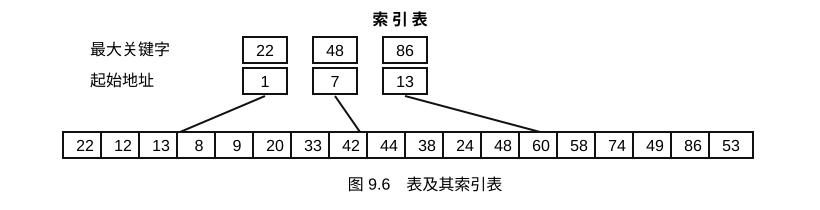
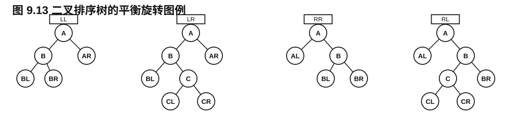
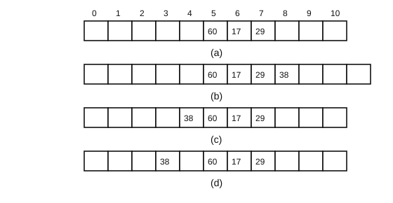

<!-- luna:source pdf_pages="224-272" book_pages="214-262" -->
# 第 9 章 查找

> **📌 本章主线**
>
> 查找先确定“用什么标识记录”，再选择“怎样组织记录以缩短定位路径”。静态查找表只查询，动态查找表还允许插入和删除；顺序、有序、树形与哈希结构分别以扫描、缩小区间、沿树下降和地址映射来定位记录。评价时必须同时写清成功/失败、数据有序性、存储方式、查找概率与装填因子等前提。

> **🎯 408 复习定位**
>
> 需要能计算平均查找长度，手推折半查找、二叉排序树与 AVL 调整、B-树分裂/合并、开放定址探测过程；还要能说明算法不变量、成功与失败的终止条件，以及复杂度结论依赖的模型。

## 本章知识地图

| 组织方式 | 核心关系 | 定位过程 | 决定代价的主要因素 |
| --- | --- | --- | --- |
| 无序顺序表/链表 | 仅同属集合 | 逐个比较 | 记录数与访问概率 |
| 有序顺序表 | 关键字单调 | 折半、斐波那契或插值定位 | 表长、分割方式、关键字分布 |
| 索引顺序表 | 块间有序、块内可无序 | 先定块，再块内顺序查找 | 块数与块长 |
| 二叉排序树/AVL 树 | 左小右大 | 从根沿一条路径下降 | 树高 |
| B-树/B+ 树 | 多路有序且同层到达外部结点/叶层 | 结点间下降、结点内比较 | 树高与结点内查找 |
| 键树/Trie | 路径上的符号组成关键字 | 按字符或数位逐层定位 | 关键字长度、分支表示 |
| 哈希表 | 地址由关键字映射 | 算地址并按冲突规则探测 | 哈希函数、冲突方法、装填因子 |

## 基本概念与统一约定

<!-- source: section="chapter-intro" source_file="index.md" pdf_pages="224-225" book_pages="214-215" items="查找表, 关键字, 主关键字, 次关键字, 查找成功/失败" -->

### 查找表、关键字与查找结果

**查找表**是由同一类型的数据元素或记录构成的集合；元素间的逻辑关系仅是“同属一个集合”。为了高效查找，存储时通常要人为增加顺序、树形或地址映射关系。

**关键字**是记录中用来识别记录的数据项值。能唯一识别一个记录的是**主关键字**；只能识别若干记录的是**次关键字**。数据元素只有一个数据项时，该数据项的值就是关键字。

**查找**是按给定值 `key`，在表中确定关键字等于 `key` 的记录。成功时返回记录或位置；失败时返回空记录、空指针或约定的失败位置。

| 类型 | 允许的主要操作 | 结构是否在查找过程中改变 |
| --- | --- | --- |
| 静态查找表 | 查询是否存在、检索记录属性、遍历 | 否 |
| 动态查找表 | 查找、插入、删除、遍历 | 是 |

### 关键字与记录的教材表示

下列类型是互斥示例，实际程序只选择一种 `KeyType`：

```c
typedef int KeyType;       /* 也可按需要改为 float 或 char * */

typedef struct {
    KeyType key;
    /* 其他记录域 */
} SElemType;
```

数值关键字可直接比较；字符串关键字要以 `strcmp` 的结果定义相等和次序。后文代码中的 `EQ`、`LT`、`LE` 均表示与关键字类型一致的比较操作。

### 平均查找长度

查找算法的基本操作是“给定值与记录关键字比较”。在查找成功的模型中，若第 $i$ 个记录被查找的概率为 $P_i$，找到它需要比较 $C_i$ 次，则平均查找长度（Average Search Length，ASL）为

$$
ASL=\sum_{i=1}^{n}P_iC_i,\qquad \sum_{i=1}^{n}P_i=1. \tag{9-1}
$$

公式必须同时说明：记录的查找概率、成功或失败模型，以及 $C_i$ 的计数口径。失败不可忽略时，应另算失败查找长度，再按成功/失败概率加权；不能直接套用只含成功概率的式（9-1）。

## 9.1 静态查找表

<!-- source: section="9.1" source_file="09-01-static-search/index.md" pdf_pages="226-236" book_pages="216-226" items="算法9.1-9.4, 式(9-1)-(9-16), 例9-1, 例9-2, 图9.2-图9.6" -->

静态查找表的基本操作包括创建、销毁、查找和遍历。遍历要求按某种次序对每个元素调用访问函数一次且仅一次；若访问函数失败，遍历失败。不同表示法的差别集中在查找操作。

### 9.1.1 顺序表的查找

顺序查找从表的一端逐项比较，既可用于顺序存储，也可用于线性链表；记录是否按关键字有序不影响适用性。

#### 顺序表表示与哨兵算法

教材算法 9.1 令有效记录占 `elem[1..length]`，`elem[0]` 留作哨兵：

```c
typedef struct {
    SElemType *elem;  /* elem[1..length] 有效，elem[0] 作哨兵 */
    int length;
} SSTable;

int Search_Seq(SSTable ST, KeyType key) {
    int i;
    ST.elem[0].key = key;
    for (i = ST.length; !EQ(ST.elem[i].key, key); --i) {
        /* 空循环体 */
    }
    return i;         /* i>0 成功；i==0 失败 */
}
```

循环开始于下标 $n$。每次比较前，区间 `i+1..n` 已确认不含目标；哨兵保证最迟在 `i=0` 时相等，因此循环不必每轮检查越界。哨兵也可放在高下标端，但扫描方向和返回约定要同步改变。

> **🧭 条件与边界**
>
> 空表令 `length=0`，函数直接比较哨兵并返回 0。若 0 号单元不是可写空间，便不能使用这一实现；若记录允许重复关键字，逆向扫描返回下标最大的匹配记录。

#### 顺序查找的平均查找长度

从后向前查找时，第 $i$ 个记录成功所需比较次数为

$$C_i=n-i+1.$$

因此

$$
ASL=nP_1+(n-1)P_2+\cdots+2P_{n-1}+P_n. \tag{9-2}
$$

等概率 $P_i=1/n$ 时，

$$
ASL_{ss}=\frac1n\sum_{i=1}^{n}(n-i+1)=\frac{n+1}{2}. \tag{9-3}
$$

若访问概率已知，把高概率记录放在扫描起点附近可减小式（9-2）：本实现从后向前扫描，故应满足 $P_n\ge P_{n-1}\ge\cdots\ge P_1$。概率未知时，教材提出维护访问频度非递减次序，或每次命中后把记录移到表尾。

按教材“比较到哨兵也计一次”的口径，失败查找比较 $n+1$ 次。若成功与失败各占 $1/2$，且每个成功记录等概率，即每个成功记录的无条件概率为 $1/(2n)$，则

$$
ASL'_{ss}=\frac{1}{2n}\sum_{i=1}^{n}(n-i+1)+\frac12(n+1)
=\frac34(n+1). \tag{9-4}
$$

> **⚠ 易错提醒**
>
> “失败比较 $n+1$ 次”依赖于把哨兵比较计入关键字比较数；不计哨兵时通常写 $n$ 次。答题时先声明计数口径。

顺序查找成功与失败均为 $O(n)$，辅助空间为 $O(1)$；优点是表示和关键字次序几乎不受限制。

### 9.1.2 有序表的查找

有序表满足

$$
ST.elem[i].key\le ST.elem[i+1].key,\qquad 1\le i<n.
$$

#### 折半查找算法与不变量

教材算法 9.2 的折半查找要求**顺序存储且按关键字有序**。线性链表即使有序，也无法按下标常数时间访问中点，因而不能有效折半。

```c
int Search_Bin(SSTable ST, KeyType key) {
    int low = 1, high = ST.length;
    while (low <= high) {
        int mid = (low + high) / 2;
        if (EQ(key, ST.elem[mid].key)) return mid;
        if (LT(key, ST.elem[mid].key)) high = mid - 1;
        else                          low  = mid + 1;
    }
    return 0;
}
```

循环不变量：若目标存在，则它必在闭区间 `[low, high]` 中。比较中点后，按关键字有序性排除中点及不可能的一半；区间严格缩小。`low>high` 表示候选区间为空，查找失败。若有序表允许重复关键字，该算法只保证返回某个匹配位置，不保证第一个或最后一个匹配位置。

最小例：表 `(05,13,19,21,37,56,64,75,80,88,92)` 中查找 21，区间依次为 `[1,11]→[1,5]→[4,5]`，第三次比较成功；查找 85 最终得到 `low>high`。

#### 折半查找的判定树与复杂度

判定树的内部结点对应一次关键字比较。成功查找某记录的比较次数等于相应内部结点的层次；失败查找对应走到一个外部结点，比较次数等于路径上的内部结点数。

含 $n$ 个内部结点的折半判定树深度为

$$\lfloor\log_2 n\rfloor+1,$$

故成功和失败的最坏比较次数均不超过该值。

当 $n=2^h-1$ 且成功记录等概率时，判定树是深度为 $h$ 的满二叉树：

$$
\begin{aligned}
ASL_{bs}
&=\frac1n\sum_{j=1}^{h}j2^{j-1}\\
&=\frac{n+1}{n}\log_2(n+1)-1. \tag{9-5}
\end{aligned}
$$

教材对任意且较大的 $n$ 给出近似

$$
ASL_{bs}\approx\log_2(n+1)-1. \tag{9-6}
$$

折半查找时间复杂度为 $O(\log n)$，辅助空间为 $O(1)$（迭代实现）。

#### 斐波那契查找与插值查找

**斐波那契查找**利用 $F_0=0,F_1=1,F_i=F_{i-1}+F_{i-2}$ 分割有序表。若 $n=F_m-1$，先比较位置 $F_{m-1}$：左子表长 $F_{m-1}-1$，右子表长 $F_{m-2}-1$，递归按同样方式缩小。教材结论是其平均性能可优于折半查找、最坏情况仍为 $O(\log n)$ 但劣于折半查找；分割只用加减运算。

**插值查找**按给定值在端点关键字区间中的相对位置估计比较位置，适合关键字近似均匀分布的有序顺序表。原书 PDF 第 232 页（印刷第 222 页）给出的式子为

$$
i=\frac{key-ST.elem[l].key}{ST.elem[h].key-ST.elem[l].key}(h-l+1).
$$

> **🔎 原书公式与下标约定**
>
> 原书同章 PDF 第 226 页把有效记录定义为 `elem[1..length]`，第 230 页的折半代码又明确令 `low=1`、`high=length`。在这一闭区间约定下，原式令最小端点得到 $i=0$，且令最大端点得到 $i=h-l+1$；它也没有规定整数下标如何取整。因此，原式不能直接作为区间 `[l,h]` 的绝对下标使用。

要与教材的 1 基表以及任意当前闭区间 `[l,h]` 一致，比较位置应写为

$$
i=l+\left\lfloor
\frac{key-ST.elem[l].key}{ST.elem[h].key-ST.elem[l].key}(h-l)
\right\rfloor.
$$

这一定义与下标基址无关：整表为 1 基 `[1,n]` 时，最小、最大关键字分别映射到 `1`、`n`；整表为 0 基 `[0,n-1]` 时，分别映射到 `0`、`n-1`。实现还必须先处理以下边界：

1. `l>h` 时区间为空，查找失败；`key` 小于左端点或大于右端点时，利用有序性直接失败；
2. `ST.elem[l].key==ST.elem[h].key` 时分母为 0，应直接比较端点：相等则返回端点，否则失败；
3. 上式按向下取整得到整数下标。对整数关键字，可在保证分子非负后用加宽整数先乘后除；不能先做整数除法，否则多数比值会先被截成 0。

### 9.1.3 静态树表的查找

等概率时，折半判定树性能优良；记录查找概率不等时，应把高权结点放在较浅层。静态树表保持有序记录的中序次序，同时按权值安排树形。教材的 5 个记录例中，概率为 `(0.1,0.2,0.1,0.4,0.2)`：普通折半判定树的成功 ASL 为 2.3，先比较第 4 个高概率记录后降为 1.8。

#### 静态最优与次优查找树

设第 $i$ 个结点层次为 $h_i$，权值 $w_i=cP_i$，则带权内路径长度为

$$
PH=\sum_{i=1}^{n}w_ih_i. \tag{9-7}
$$

在所有保持关键字中序有序的二叉树中，使 $PH$ 最小的是**静态最优查找树**。其精确构造代价较高，教材改用近似最优的**次优查找树**。

对有序记录区间

$$
(r_l,r_{l+1},\ldots,r_h),\qquad r_l.key<\cdots<r_h.key, \tag{9-8}
$$

对应权值序列为

$$
(w_l,w_{l+1},\ldots,w_h). \tag{9-9}
$$

候选根 $r_i$ 的左右权值差为

$$
\Delta P_i=
\left|\sum_{j=i+1}^{h}w_j-\sum_{j=l}^{i-1}w_j\right|. \tag{9-10}
$$

选择使 $\Delta P_i$ 最小的 $i$ 为根，再递归构造左右区间。定义累计权值

$$
sw_i=\sum_{j=1}^{i}w_j,\qquad sw_0=0, \tag{9-11}
$$

则

$$
\begin{cases}
sw_{i-1}-sw_{l-1}=\displaystyle\sum_{j=l}^{i-1}w_j,\\
sw_h-sw_i=\displaystyle\sum_{j=i+1}^{h}w_j.
\end{cases} \tag{9-12}
$$

$$
\Delta P_i=|(sw_h+sw_{l-1})-sw_i-sw_{i-1}|. \tag{9-13}
$$

#### 次优查找树构造算法

下面保留教材算法 9.3 的区间递归核心；“空表置空，否则先求累计权值并以 `[1,n]` 调用”的外层步骤对应算法 9.4。

```cpp
void SecondOptimal(BiTree &T, ElemType R[], float sw[],
                   int low, int high) {
    int i = low;
    float dw = sw[high] + sw[low - 1];
    float best = abs(sw[high] - sw[low]);

    for (int j = low + 1; j <= high; ++j) {
        float delta = abs(dw - sw[j] - sw[j - 1]);
        if (delta < best) {
            i = j;
            best = delta;
        }
    }

    T = (BiTree)malloc(sizeof(BiTNode));
    T->data = R[i];
    if (i == low) T->lchild = NULL;
    else SecondOptimal(T->lchild, R, sw, low, i - 1);
    if (i == high) T->rchild = NULL;
    else SecondOptimal(T->rchild, R, sw, i + 1, high);
}
```

不变量是每棵子树仍对应原有序序列的一个连续区间；因此中序序列不变。空表构造为空树，非空表先计算 `sw`，再以区间 `[1,n]` 调用算法。

最小例：权值 `(1,1,2,5,3,4,4,3,5)` 对应关键字 `A..I`，算法选 `F` 为根；左右依次得到 `D、H`，再得到 `B、E、G、I`，`B` 的孩子为 `A、C`。若候选根自身权值显著小于相邻关键字，教材建议改选邻近的较大权关键字；权值 `(1,30,2,29,3)` 的例子中，调整可把 $PH$ 从 132 降为 105。

教材给出：次优查找树与最优树的查找性能差通常很小，构造算法时间复杂度为 $O(n\log n)$；查找沿根到目标或空子树的一条路径，比较次数不超过树深度，平均查找长度与 $\log n$ 成正比。

> **📚 教材扩展**
>
> 静态最优树、次优树用于查找概率不等且表内容相对稳定的场景；它们与后文可动态插删的二叉排序树不是同一概念。

### 9.1.4 索引顺序表的查找

分块查找又称索引顺序查找。表被划分为若干块；每个索引项至少含“该块最大关键字”和“该块首记录位置”。索引表按最大关键字有序；块内记录可任意排列，但块间必须满足后一块所有关键字都大于前一块的最大关键字，这称为**分块有序**。



*基于教材图 9.6 复用。正文中的块间有序条件与两阶段查找构成完整文字降级。*

查找分两步：

1. 在有序索引表中顺序或折半查找，确定目标可能所在的块；
2. 在该块中顺序查找，因为块内不要求有序。

平均查找长度为

$$
ASL_{block}=L_b+L_w, \tag{9-14}
$$

其中 $L_b$ 是定块代价，$L_w$ 是块内代价。设表长 $n$，均匀分为 $b$ 块，每块 $s$ 个记录，近似有 $b=n/s$，且所有记录等概率。

索引表顺序查找时，

$$
\begin{aligned}
ASL_{block}
&=\frac{b+1}{2}+\frac{s+1}{2}\\
&=\frac12\left(\frac ns+s\right)+1. \tag{9-15}
\end{aligned}
$$

给定 $n$，取 $s=\sqrt n$ 时最小，得到 $ASL_{block}=\sqrt n+1$。若索引表折半查找，则教材给出

$$
ASL'_{block}\approx
\log_2\left(\frac ns+1\right)+\frac s2. \tag{9-16}
$$

> **⚠ 易错提醒**
>
> 分块查找只要求块间有序，不要求块内有序；因此第二阶段不能直接折半。若最后一块不足 $s$ 个记录，式（9-15）只是均匀分块模型下的结果。

## 9.2 动态查找表

<!-- source: section="9.2" source_file="09-02-dynamic-search/index.md" pdf_pages="236-261" book_pages="226-251" items="算法9.5-9.16, 式(9-17)-(9-24), 图9.7-图9.22" -->

动态查找表在查找过程中生成或改变：目标已存在则返回；不存在时可插入；也可删除已存在记录。基本操作为初始化、销毁、查找、插入、删除和遍历。本节以树结构实现。

### 9.2.1 二叉排序树与平衡二叉树

#### 二叉排序树的定义、表示与查找

**二叉排序树**（二叉查找树）或者为空，或者满足：

1. 左子树所有关键字严格小于根关键字；
2. 右子树所有关键字严格大于根关键字；
3. 左、右子树也分别是二叉排序树。

严格不等号意味着本章实现不保存重复关键字。二叉链表结点含记录、左孩子和右孩子指针。

```c
BiTree SearchBST(BiTree T, KeyType key) {
    if (T == NULL || EQ(key, T->data.key)) return T;
    if (LT(key, T->data.key)) return SearchBST(T->lchild, key);
    return SearchBST(T->rchild, key);
}
```

每次递归前的不变量是：若目标存在，它必在当前子树。遇到相等结点成功，遇到空指针失败；比较次数等于经过的结点数。

#### 插入与删除

插入先按查找路径定位。失败时，新结点一定接到失败路径最后一个非空结点的空孩子位置；空树则新结点成为根。若已存在相同关键字，教材实现返回失败而不重复插入。例如依次处理 `{45,24,53,45,12,24,90}` 时，第二个 45 和 24 被拒绝，最终只插入 `45、24、53、12、90`。

```cpp
bool SearchBST(BiTree T, KeyType key, BiTree parent, BiTree &p) {
    if (!T) { p = parent; return false; }
    if (EQ(key, T->data.key)) { p = T; return true; }
    if (LT(key, T->data.key)) return SearchBST(T->lchild, key, T, p);
    return SearchBST(T->rchild, key, T, p);
}

bool InsertBST(BiTree &T, ElemType e) {
    BiTree p;
    if (SearchBST(T, e.key, NULL, p)) return false;
    BiTree s = (BiTree)malloc(sizeof(BiTNode));
    s->data = e;
    s->lchild = s->rchild = NULL;
    if (!p) T = s;
    else if (LT(e.key, p->data.key)) p->lchild = s;
    else p->rchild = s;
    return true;
}
```

删除结点 `p` 后必须保持中序关键字严格递增：

| `p` 的孩子情况 | 重接方式 |
| --- | --- |
| 无孩子 | 双亲相应孩子指针置空 |
| 只有左孩子 | 以左子树替代 `p` |
| 只有右孩子 | 以右子树替代 `p` |
| 左右孩子都有 | 用直接前驱（左子树最大结点）或直接后继替换 `p` 的数据，再删除该前驱/后继 |

以前驱替换时，前驱最多只有左孩子，因此最终转化为“无右孩子”的简单情况：

```cpp
bool DeleteNode(BiTree &p) {
    BiTree q, s;
    if (!p->rchild) {
        q = p; p = p->lchild; free(q);
    } else if (!p->lchild) {
        q = p; p = p->rchild; free(q);
    } else {
        q = p; s = p->lchild;
        while (s->rchild) { q = s; s = s->rchild; }
        p->data = s->data;
        if (q != p) q->rchild = s->lchild;
        else        q->lchild = s->lchild;
        free(s);
    }
    return true;
}
```

> **⚠ 易错提醒**
>
> 两孩子删除不能只把前驱值复制到 `p` 就结束；还必须从原位置删除前驱，并把前驱的左子树接回其双亲。

#### 二叉排序树的查找分析

查找代价为路径结点数，故为 $O(h)$，其中 $h$ 是树高。相同关键字集合因插入顺序不同可形成不同树：有序序列逐个插入会退化成单支树，$h=n$，等概率成功 ASL 为 $(n+1)/2$；接近折半判定树时，$h$ 与 $\log_2n$ 同量级。

教材进一步分析随机插入。设长度为 $n$ 的序列中有 $i$ 个关键字小于首关键字、$n-i-1$ 个大于它，等概率查找时

$$
P(n,i)=\frac1n\{1+i[P(i)+1]+(n-i-1)[P(n-i-1)+1]\}. \tag{9-17}
$$

若首关键字成为第 $1,2,\ldots,n$ 小关键字的概率相等，则

$$
P(n)=1+\frac2{n^2}\sum_{i=1}^{n-1}iP(i),\qquad n\ge2, \tag{9-18}
$$

并有递推

$$
P(n)=\left(1-\frac1{n^2}\right)P(n-1)+\frac2n-\frac1{n^2}. \tag{9-19}
$$

解得

$$
P(n)=2\frac{n+1}{n}\left(\frac12+\frac13+\cdots+\frac1{n+1}\right)-1
\le2\left(1+\frac1n\right)\ln n. \tag{9-20}
$$

因此随机模型下平均查找长度与 $\log n$ 同量级，但最坏形态仍为单支树。教材另给出“某些情况下约有 46.5% 的概率仍需平衡化”的表述，未说明该概率对应的事件与推导，本页不把它用于计算。

#### 平衡二叉树（AVL 树）

**平衡二叉树**又称 AVL 树：空树是 AVL 树；非空时左右子树均为 AVL 树，且高度差绝对值不超过 1。定义结点平衡因子

$$BF=h_{left}-h_{right},$$

故每个结点只能取 `-1、0、1`。只要某结点 $|BF|>1$，整棵树便不平衡。

插入后，令 `a` 为离新结点最近且 $|BF|>1$ 的祖先，只调整以 `a` 为根的最小不平衡子树：

| 类型 | 新结点所在位置 | 调整顺序 |
| --- | --- | --- |
| LL | `a` 左孩子的左子树 | 对 `a` 单右旋 |
| RR | `a` 右孩子的右子树 | 对 `a` 单左旋 |
| LR | `a` 左孩子的右子树 | 先对左孩子左旋，再对 `a` 右旋 |
| RL | `a` 右孩子的左子树 | 先对右孩子右旋，再对 `a` 左旋 |



*基于教材图 9.13 复用。表格给出了不依赖图片的旋转顺序。*

```cpp
void R_Rotate(BSTree &p) {
    BSTree lc = p->lchild;
    p->lchild = lc->rchild;
    lc->rchild = p;
    p = lc;
}

void L_Rotate(BSTree &p) {
    BSTree rc = p->rchild;
    p->rchild = rc->lchild;
    rc->lchild = p;
    p = rc;
}
```

旋转必须保持中序序列不变。调整后新子树恢复平衡，且其高度与插入前以 `a` 为根的子树高度相同，所以插入时只需调整最小不平衡子树。

教材插入算法以 `taller` 表示当前子树是否因插入长高。向左子树插入并长高时：原 `BF=LH` 则左平衡并令 `taller=false`；原 `BF=EH` 改为 `LH` 且继续向上传播长高；原 `BF=RH` 改为 `EH` 且停止长高。向右插入完全对称。LR 双旋时还要根据中间结点原 `BF` 更新失衡根和左孩子的 `BF`；右平衡对称处理。

> **🧭 正确性不变量**
>
> 旋转只改变局部父子关系，不改变 `BL < B < ... < A < ... < AR` 的中序次序；同时把局部高度差恢复到至多 1。只会“形状变化”而不会破坏二叉排序树关键字关系。

#### AVL 树高度与查找复杂度

令深度为 $h$ 的 AVL 树最少结点数为 $N_h$：

$$
N_0=0,\quad N_1=1,\quad N_2=2,\quad
N_h=N_{h-1}+N_{h-2}+1.
$$

因此

$$N_h=F_{h+2}-1.$$

利用 $F_h\approx\varphi^h/\sqrt5$，$\varphi=(1+\sqrt5)/2$，教材给出含 $n$ 个结点 AVL 树的最大深度关系

$$
h\le \log_{\varphi}(\sqrt5(n+1))-2,
$$

故查找、插入的定位阶段均为 $O(\log n)$；旋转只涉及常数个局部指针。二叉排序树与 AVL 树是动态树表，最优或次优查找树是静态树表。

### 9.2.2 B-树与 B+ 树

#### B-树定义、结点表示与查找

**B-树**是平衡多路查找树。一棵 $m$ 阶 B-树为空，或满足：

1. 每个实际结点至多有 $m$ 棵子树，即至多 $m-1$ 个关键字；
2. 非叶根结点至少有 2 棵子树，即至少 1 个关键字；
3. 除根外，每个非终端实际结点至少有 $\lceil m/2\rceil$ 棵子树，即至少 $\lceil m/2\rceil-1$ 个关键字；
4. 含 $k$ 个关键字的结点表示为
   $$(k,A_0,K_1,A_1,\ldots,K_k,A_k),$$
   其中 $K_1<\cdots<K_k$；$A_0$ 子树关键字小于 $K_1$，对 $1\le i<k$，$A_i$ 子树关键字位于 $(K_i,K_{i+1})$，$A_k$ 子树关键字大于 $K_k$；
5. 所有外部叶结点在同一层，外部叶不存信息，实际实现中对应空指针和失败位置。

实际结点还应为每个关键字保存指向记录的指针。结点内关键字通常存为 `key[1..k]`，子树指针存为 `ptr[0..k]`。

教材算法 9.13 的 B-树查找交替进行两种操作：

1. 在当前结点的有序关键字中顺序或折半查找；
2. 相等则成功，否则按关键字所在区间选择一个子树指针继续下降。

```text
p ← 根，q ← 空
while p 非空：
    i ← 在 p.key 中确定相等位置或应走的 ptr[i]
    if p.key[i] == K：返回 (p, i, 成功)
    q ← p
    p ← p.ptr[i]
返回 (q, i, 失败)    // q、i 同时给出插入位置
```

不变量：若 $K$ 存在，它必在当前结点或当前选择的唯一子树区间中。B-树常存于外存；定位一个结点需要一次昂贵的外存访问，而结点内比较在内存完成，因此首要目标是降低树高。

> **🔎 教材代码边界**
>
> 原书 PDF 第 250 页（印刷第 240 页）的 `Result.i` 注释写 `1..m`，但算法先令 `i=0`，且失败分支按 `ptr[i]` 下降。对含 $k$ 个关键字的结点，`Search(p,K)` 实际返回“不大于 $K$ 的关键字个数” $i\in[0,k]$：$K<K_1$ 时 $i=0$，$K_k\le K$ 时 $i=k$，中间区间满足 $K_i\le K<K_{i+1}$。成功时 $i\in[1,k]$，失败时 $i\in[0,k]$ 并同时表示 `ptr[i]` 与插入间隙。正文统一采用“关键字 `1..k`、孩子/间隙 `0..k`”。

#### B-树查找高度

若一棵 $m$ 阶 B-树总深度为 $l+1$，第 $l+1$ 层是外部叶，表中有 $N$ 个关键字，则外部叶数为 $N+1$。最少分支模型给出

$$
N+1\ge2\left\lceil\frac m2\right\rceil^{l-1},
$$

从而

$$
l\le
\log_{\lceil m/2\rceil}\left(\frac{N+1}{2}\right)+1. \tag{9-21}
$$

从根到目标实际结点所访问的结点数不超过该量级；阶数越大，单结点容量越大，树高通常越低，但结点内查找和存储也随之增加。

#### B-树插入与删除

插入总在最低层实际结点进行。若插入后关键字数不超过 $m-1$，结束；若原结点已有 $m-1$ 个关键字，插入后得到 $m$ 个关键字，令 $s=\lceil m/2\rceil$，分裂为：

$$
(s-1,A_0,K_1,A_1,\ldots,K_{s-1},A_{s-1}), \tag{9-22}
$$

$$
(m-s,A_s,K_{s+1},A_{s+1},\ldots,K_m,A_m). \tag{9-23}
$$

中间关键字 $K_s$ 上移到双亲，并把新右结点指针一同插入双亲。双亲若也溢出，继续向上分裂；根分裂时新建一个只含上移关键字的新根，树高加 1。

教材图 9.16 的连续插入例中，插入 30、26、85、7 会依次触发最低层分裂、分隔关键字上移以及双亲溢出后的继续分裂，最终可能产生新根；它所表达的状态变化已由式（9-22）、式（9-23）和上述逐层传播规则完整给出。

教材算法 9.14 的删除先定位关键字。若关键字在非最低层实际结点，用相邻子树中的后继（教材取相应子树的最小关键字）替换，再转化为最低层删除：

| 删除后状态 | 调整 |
| --- | --- |
| 关键字数仍不少于 $\lceil m/2\rceil-1$ | 直接删除 |
| 低于下限，且相邻兄弟高于下限 | 向兄弟借关键字：双亲分界关键字下移，兄弟边界关键字上移 |
| 本结点和相邻兄弟都在下限 | 与兄弟及双亲分界关键字合并；双亲少一个关键字，必要时继续向上处理 |

> **⚠ 易错提醒**
>
> B-树“平衡”是所有失败外部叶在同一层，不是每个结点左右高度差不超过 1。插入的分裂可能向根传播；删除的下溢也可能向根传播。

#### B+ 树

$m$ 阶 B+ 树是 B-树的变型：

1. 有 $k$ 棵子树的结点含 $k$ 个关键字；
2. 全部关键字及相应记录指针只在叶结点保存，叶结点按关键字递增链接；
3. 非终端结点只作索引，关键字是相应子树的最大值或最小值，具体取决于约定。

通常设置两个头指针：一个指向根，一个指向最小关键字叶结点，因此既能从根随机查找，也能从最小叶开始顺序查找。

即使在非终端索引结点遇到相等关键字，也必须继续下降到叶结点；随机查找每次都走完整根到叶路径。插入只在叶层：关键字数超过 $m$ 时分为 $\lceil(m+1)/2\rceil$ 与 $\lfloor(m+1)/2\rfloor$ 个关键字，并更新双亲索引。删除也在叶层进行；若删去叶中边界关键字，要同步更新祖先分界值，下溢后的借位与合并类似 B-树。

| 维度 | B-树 | B+ 树 |
| --- | --- | --- |
| 记录位置 | 关键字所在实际结点可带记录指针 | 记录只在叶层 |
| 内部关键字 | 代表实际记录并分隔子树 | 仅作索引，可在叶层重复 |
| 命中内部关键字 | 可立即成功 | 仍需下降到叶层 |
| 顺序访问 | 需树遍历 | 叶结点有序链支持顺序扫描 |

### 9.2.3 键树

**键树**又称数字查找树，是度不小于 2 的树。结点不保存完整关键字，而保存组成关键字的一个符号：数字关键字保存一位，单词关键字保存一个字符。根到叶路径上的符号组成一个关键字，特殊符号 `$` 表示字符串结束，叶结点指向记录。

键树是有序树：同层兄弟符号从左到右有序，且教材约定 `$` 小于任何普通字符。关键字集合按第 1、2、3……个符号不断分组，直到每组只含一个关键字。

#### 双链树表示

教材算法 9.15 使用孩子—兄弟双链结构逐字符查找。

孩子兄弟链表把每个分支结点表示为 `symbol`、第一孩子指针 `first`、右兄弟指针 `next`；叶结点的 `infoptr` 指向记录。查找第 $i$ 个字符时，先沿兄弟链找相等 `symbol`，相等后沿 `first` 进入下一层；兄弟链到空则失败。

```c
typedef enum { LEAF, BRANCH } NodeKind;

typedef struct DLTNode {
    char symbol;
    struct DLTNode *next;
    NodeKind kind;
    union {
        Record *infoptr;
        struct DLTNode *first;
    } link;
} DLTNode, *DLTree;
```

若关键字含结束符共 `num` 个字符，查找必须在每一层先匹配当前字符，再决定是否下降。成功时最终结点应为叶结点并返回记录指针。

设每结点最大度为 $d$，树深为 $h$。教材给出：单词含结束符时 $d=27$，十进制数含结束符时 $d=11$；若字符随机且关键字等长，双链树每位平均顺序长度为 $(1+d)/2$，总平均长度为

$$
h\frac{1+d}{2}.
$$

#### Trie 多重链表表示

教材算法 9.16 使用字符序号直接选择 Trie 分支。

Trie 的分支结点直接含 $d$ 个指针，字符由“它是双亲的第几个指针”确定；另设 `num` 记录非空指针数。叶结点保存完整关键字和记录指针。若从某结点到叶的路径始终只有一个孩子，可压缩成一个叶结点，从而减少单支路径。

```c
typedef struct TrieNode {
    NodeKind kind;
    union {
        struct { KeysType K; Record *infoptr; } leaf;
        struct { struct TrieNode *ptr[27]; int num; } branch;
    } u;
} TrieNode, *TrieTree;
```

查找从根开始：只要当前是分支结点且尚有字符，就用 `ord(K.ch[i])` 选择一个指针；到叶后还必须比较完整关键字，防止压缩路径造成误判。空指针或叶关键字不等均失败。

Trie 查找时间取决于经过的层数；代价是每个分支结点保留 $d$ 个指针。教材还给出两种调节：改变分割字符的次序以缩短深度；或限制最大深度为 $l$，让前 $l-1$ 层仍同义的关键字共用一个叶结点。插入、删除通过增删分支完成；分支结点 `num` 降为 1 时可压缩删除。结点度较大时，Trie 比逐兄弟扫描的双链树更合适。

## 9.3 哈希表

<!-- source: section="9.3" source_file="09-03-hash-table/index.md" pdf_pages="261-272" book_pages="251-262" items="算法9.17-9.18, 式(9-25)-(9-34), 例9-3, 例9-4, 图9.23-图9.27" -->

### 9.3.1 什么是哈希表

比较型查找需要沿线性或树形路径不断比较。哈希方法尝试建立关键字到存储位置的确定映射 $H(key)$：由关键字先算地址，再检查该位置。

**哈希函数**把关键字映射到有限地址集；**哈希地址**是函数值对应的存储位置；按哈希函数和冲突处理规则建立的表是**哈希表**。

若 $key_1\ne key_2$ 但

$$H(key_1)=H(key_2),$$

则发生**冲突**，这两个关键字相对该函数互为**同义词**。关键字集合通常远大于地址集合，所以哈希函数是压缩映射，冲突一般只能减少而不能彻底避免；建表必须同时确定哈希函数与冲突处理方法。

若任一关键字映射到地址集中各位置的概率相等，称哈希函数是**均匀哈希函数**。均匀性使地址分布更分散，但不意味着给定有限样本一定无冲突。

### 9.3.2 哈希函数的构造方法

#### 常用构造方法

| 方法 | 公式或做法 | 适用条件与边界 |
| --- | --- | --- |
| 直接定址法 | $H(key)=key$ 或 $H(key)=a\cdot key+b$ | 地址集合能覆盖关键字取值区间；不同关键字不冲突，但空间可能很大 |
| 数字分析法 | 从关键字中选分布较均匀的若干位，或把若干位叠加 | 可能出现的关键字事先已知；固定不变或取值很少的位不应选 |
| 平方取中法 | 取关键字平方的中间若干位 | 中间位与原关键字多位相关；取位数由表长决定 |
| 折叠法 | 等长分段后移位叠加或间界叠加，舍去进位 | 关键字很长且各位分布大致均匀 |
| 除留余数法 | $H(key)=key\operatorname{MOD}p$，$p\le m$ | 最常用；$p$ 的因子结构会影响地址分布 |
| 随机数法 | $H(key)=random(key)$ | 教材建议用于关键字长度不等的情况 |

直接定址法的地址集合与关键字集合等大，因此不冲突；但大关键字空间会造成大量空地址。

数字分析法的关键是排除“几乎恒定”的位，选择近似随机的位。平方取中法先让原关键字各位共同影响平方的中部，再按表长取足够位数。

折叠法把长关键字分段：移位叠加让各段最低位对齐；间界叠加把相邻段反向折回再相加。教材 ISBN 例中，两种叠加会得到不同地址，说明构造规则必须在建表与查找时完全一致。

除留余数法中，若 $p$ 为 $2$ 的幂，取模可能只保留低位；若 $p$ 含小质因子，具有相同因子结构的关键字可能集中到少数地址。教材经验是一般选质数，或选不含小于 20 的质因数的合数。

选择哈希函数时同时考虑：计算时间、关键字长度、表大小、关键字分布与记录查找频率。

### 9.3.3 处理冲突的方法

统一令哈希表长度为 $m$，地址集为 $0..m-1$。初始地址已占用时，冲突规则产生后继地址 $H_1,H_2,\ldots$，直到找到可用位置或确定失败。原书 PDF 第 267 页先把地址上界写成 $n-1$，随后式（9-25）改用 $m$ 表示表长；本页按公式及后文分析统一为 $m$。

#### 开放定址法

开放定址把全部记录仍存放在哈希数组内：

$$
H_i=(H(key)+d_i)\operatorname{MOD}m,
\qquad i=1,2,\ldots,k,\quad k\le m-1. \tag{9-25}
$$

| 探测方法 | 增量序列 $d_i$ | 特点 |
| --- | --- | --- |
| 线性探测再散列 | $1,2,3,\ldots,m-1$ | 表未满时一定能找到空位；连续占用区会吸引更多关键字 |
| 二次探测再散列 | $1^2,-1^2,2^2,-2^2,\ldots,\pm k^2$，$k\le m/2$ | 减轻线性连续聚集；地址覆盖依赖表长 |
| 伪随机探测再散列 | 预定伪随机序列 | 覆盖性取决于序列 |



*基于教材图 9.25 复用。表格给出了三类探测的等价规则。*

线性探测中，不同初始地址的记录可能争夺同一后继地址；教材称该现象为“二次聚集”。只要表未满，线性探测能遍历所有地址。教材给出的二次探测覆盖条件是：表长 $m$ 为形如 $4j+3$ 的素数时才可能保证所需覆盖；伪随机探测则依赖序列设计。

#### 再哈希法、链地址法与公共溢出区

**再哈希法**准备若干不同函数：

$$
H_i=RH_i(key),\qquad i=1,2,\ldots,k. \tag{9-26}
$$

冲突时换用下一函数，较少产生聚集，但要付出额外函数计算。

**链地址法**为每个哈希地址设置一条链，所有同义词进入同一链。链内可头插、尾插，也可保持关键字有序。它把“数组定位桶”和“桶内链表查找”分开，不会让不同初始地址的记录争夺同一开放地址。

例 9-3 的关键字

$$
(19,14,23,01,68,20,84,27,55,11,10,79)
$$

按 $H(key)=key\operatorname{MOD}13$ 分组后，地址 1 的链为 `01→14→27→79`，地址 3 为 `55→68`，地址 6 为 `19→84`，地址 7 为 `20`，地址 10 为 `10→23`，地址 11 为 `11`。

**公共溢出区**把数组分为基本表和溢出表：初始地址空时放基本表；一旦冲突，不论初始地址为何都把记录放入公共溢出表。查找先检查基本表，再按规则搜索溢出区。

### 9.3.4 哈希表的查找及其分析

#### 开放定址查找与插入

教材算法 9.17、9.18 分别给出开放定址查找与插入。查找和建表必须使用同一哈希函数、同一探测规则。在没有删除标记的二状态表中，初始位置为“从未使用”则失败；关键字相等则成功；否则不断求下一探测地址，直到命中、遇到真正空位或探测序列耗尽。

```cpp
typedef struct {
    ElemType *elem;
    int count;
    int sizeindex;
} HashTable;

int SearchHash(HashTable H, KeyType K, int &p, int &c) {
    p = Hash(K);
    while (H.elem[p].key != NULLKEY &&
           !EQ(K, H.elem[p].key)) {
        collision(p, ++c);
    }
    return EQ(K, H.elem[p].key) ? SUCCESS : UNSUCCESS;
}

int InsertHash(HashTable &H, ElemType e) {
    int p, c = 0;
    if (SearchHash(H, e.key, p, c) == SUCCESS) return DUPLICATE;
    if (c < hashsize[H.sizeindex] / 2) {
        H.elem[p] = e;
        ++H.count;
        return OK;
    }
    RecreateHashTable(H);
    return UNSUCCESS;
}
```

循环不变量：在当前 `p` 之前的探测位置均已检查且不含目标；`p` 始终属于同一关键字的探测序列。`c` 既记录冲突次数，也可作为重建阈值依据。实际实现还应限制最多探测 $m$ 个不同地址，防止表满或探测序列循环时不终止。

例 9-4 使用 $H(key)=key\operatorname{MOD}13$，记录存于 `a.elem[0..15]`，线性后继地址按表长 16 取模。查找 84 的地址序列为 `6→7→8`，在 8 成功；查找 38 的序列为 `12→13`，13 为真正空位，故失败。

上述代码只有 `NULLKEY` 与“已占用”两种状态，直接对应原书未发生删除时的算法。支持删除后，槽位必须区分“从未使用”“已占用”“已删除”三种状态：

- **成功**：遇到“已占用”且关键字相等；
- **失败**：遇到“从未使用”的空位，或同一探测序列已经耗尽；
- **遇到删除标记**：不能判失败，必须沿原探测序列继续；插入可先记住第一个删除位置，但仍要继续查到重复关键字或真正空位，确认没有重复后才能复用该位置。

> **⚠ 删除边界**
>
> 开放定址表不能把删除位置直接改成“从未使用的空位”，否则查找会在这里提前停止，漏掉后来沿同一探测链插入的同义词。删除标记只表示该槽位当前无记录，不表示探测链在此终止。

#### 装填因子与平均查找长度

设哈希表中现有 $n$ 个记录、表长为 $m$，装填因子为

$$
\alpha=\frac{n}{m}
=\frac{\text{表中记录数}}{\text{哈希表长度}}.
$$

$\alpha$ 越大，空位置越少，开放定址产生长探测序列的可能性越高。哈希 ASL 由哈希函数、冲突处理方法和 $\alpha$ 共同决定；开放定址要求 $0\le\alpha<1$ 才保证仍有真正空位，链地址法的 $\alpha$ 则可大于 1。

例 9-3 的 12 个关键字等概率时，链地址表成功 ASL 为

$$
ASL=\frac1{12}(1\times6+2\times4+3+4)=1.75,
$$

相同关键字与初始哈希函数用线性探测时为

$$
ASL=\frac1{12}(1\times6+2+3\times3+4+9)=2.5.
$$

在教材的均匀散列近似模型下，并假定现有记录被成功查找的概率相等，成功 ASL 是找到一个现有关键字所比较的关键字个数的期望值：

$$
S_{nl}\approx\frac12\left(1+\frac1{1-\alpha}\right)
\qquad\text{（线性探测）}, \tag{9-27}
$$

$$
S_{nr}\approx-\frac1\alpha\ln(1-\alpha)
\qquad\text{（随机、二次探测或再哈希）}, \tag{9-28}
$$

$$
S_{nc}\approx1+\frac\alpha2
\qquad\text{（链地址）}. \tag{9-29}
$$

失败 ASL 是待查关键字不在表中时所比较关键字个数的期望值；它还需要对失败关键字的初始地址或探测序列采用相应随机模型。教材给出：

$$
U_{nl}\approx\frac12\left(1+\frac1{(1-\alpha)^2}\right), \tag{9-30}
$$

$$
U_{nr}\approx\frac1{1-\alpha}, \tag{9-31}
$$

$$
U_{nc}\approx\alpha+e^{-\alpha}. \tag{9-32}
$$

式（9-27）至式（9-32）是近似期望，不是对任意固定关键字序列的精确值；它们依赖均匀哈希以及各冲突方法相应的随机模型，开放定址公式还要求 $\alpha<1$。

#### 随机探测失败 ASL 的推导骨架

设表长 $m$、已有 $n$ 个记录，假定哈希函数均匀且冲突后的地址也是随机的。为避免源文随后复用 $p_i$ 表示记录访问概率，本页把“前 $i$ 次地址均冲突”的概率记为 $P_i$，把“第 $i$ 次找到空位”的概率记为 $Q_i$。

$$
P_0=1,qquad
P_i=\frac nm\frac{n-1}{m-1}\cdots
\frac{n-i+1}{m-i+1},\qquad P_{n+1}=0.
$$

第 $i$ 次才遇到空位，等价于前 $i-1$ 次冲突而前 $i$ 次不再全部冲突，所以

$$
Q_i=P_{i-1}-P_i. \tag{9-33}
$$

失败查找的期望比较次数为

$$
\begin{aligned}
U_n
&=\sum_{i=1}^{n+1}iQ_i\\
&=1+P_1+P_2+\cdots+P_n\\
&=\frac1{1-\frac{n}{m+1}}
\approx\frac1{1-\alpha}.
\end{aligned}
$$

第 $i+1$ 个记录成功查找的比较次数，等于它当初插入时从含 $i$ 个记录的表中找到空位的比较次数。若现有 $n$ 个记录等概率被查找，则

$$
\begin{aligned}
S_n
&=\frac1n\sum_{i=0}^{n-1}U_i\\
&=\frac1n\sum_{i=0}^{n-1}\frac1{1-i/m}\\
&\approx\frac mn\int_0^{\alpha}\frac{dx}{1-x}
=-\frac1\alpha\ln(1-\alpha).
\end{aligned}
$$

因此在上述随机模型中，平均查找长度主要是 $\alpha$ 的函数，而不是记录数 $n$ 的直接函数；扩大表并控制装填因子可以把期望查找长度限制在一定范围。

#### 完美哈希函数

若关键字集合预先已知且规模不大，可能构造无冲突的完美哈希函数。教材以 PASCAL 的 26 个保留字为例给出

$$
H(key)=L+g(key[1])+g(key[L]), \tag{9-34}
$$

其中 $L$ 为字符串长度，`key[1]` 与 `key[L]` 为首尾字符，$g$ 把字符映射为数字。该结论只适用于事先分析过的固定关键字集合，不能据此认为一般哈希函数都可无冲突。

## 章末方法对照

| 方法 | 必要前提 | 成功代价 | 失败判据 | 更新特性 |
| --- | --- | --- | --- | --- |
| 顺序查找 | 无序/有序均可，顺序表或链表 | 等概率 ASL $(n+1)/2$ | 扫描完；哨兵实现返回 0 | 结构要求最低 |
| 折半查找 | 有序顺序表 | 最坏 $\lfloor\log_2n\rfloor+1$ 次比较 | `low>high` | 插删维持有序表代价未在本章展开 |
| 分块查找 | 块间有序，索引有序 | 顺序索引且等长块时最优约 $\sqrt n+1$ | 定位块后块内扫描完 | 介于顺序与折半之间 |
| 二叉排序树 | 严格左小右大 | $O(h)$；随机模型平均 $O(\log n)$ | 沿唯一方向遇空指针 | 可动态插删，最坏退化为链 |
| AVL 树 | 二叉排序树且每结点 $|BF|\le1$ | $O(\log n)$ | 沿路径遇空指针 | 插入后用旋转恢复平衡 |
| B-树 | 多路有序、外部叶同层 | 访问结点数为对数量级 | 下降到外部叶 | 分裂、借位、合并可逐层传播 |
| B+ 树 | 记录全在有序叶层 | 每次走到叶层 | 叶层无目标 | 兼顾随机查找与叶链顺序访问 |
| 键树/Trie | 关键字可分解为符号序列 | 取决于关键字长度/树深 | 空分支或叶关键字不等 | 分支表示决定时间与空间 |
| 哈希表 | 固定哈希函数与冲突规则 | 随机模型下由 $\alpha$ 主导 | 遇真正空位或探测耗尽 | 开放定址删除需墓碑；可重建控载荷 |

## 易错点清单

1. ASL 先区分成功与失败，再声明概率和比较次数口径。
2. 折半查找要求可随机访问的有序表；有序链表不能有效折半。
3. 二叉排序树的形态取决于插入顺序；关键字集合相同不代表查找代价相同。
4. AVL 的 `BF` 在本章定义为“左高减右高”；换用相反定义时四类旋转的符号也要整体变换。
5. B-树结点内关键字下标与孩子指针下标不同：`K[1..k]` 对应 `A[0..k]`。
6. B+ 树内部命中不等于找到记录，仍须下降至叶层。
7. 开放定址查找必须沿建表时相同的探测序列；删除不能制造“从未使用的空位”。
8. 哈希期望公式依赖均匀/随机假设和装填因子，不能只凭表长判断。

## 复习闭环

- 能否从概率与比较次数写出顺序、折半、分块和哈希的 ASL？
- 能否解释折半区间、BST 子树、B-树结点区间和开放定址探测序列各自的不变量？
- 能否手推 BST 删除、AVL 四类旋转、B-树分裂/借位/合并？
- 能否区分 B-树与 B+ 树、双链键树与 Trie、开放定址与链地址？
- 能否指出每个复杂度结论依赖的有序性、树高、概率或装填因子条件？

